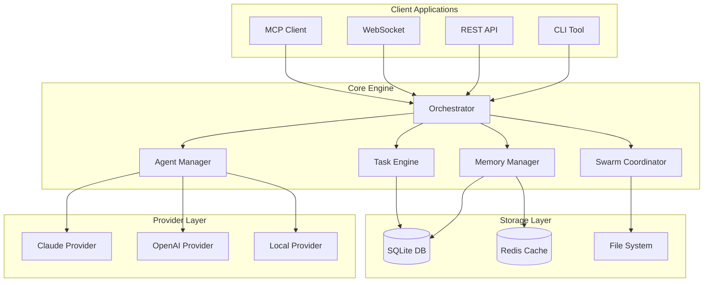
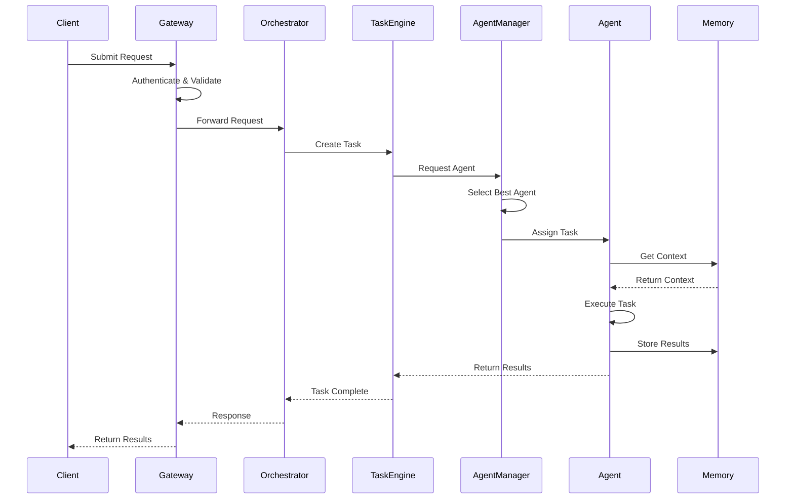
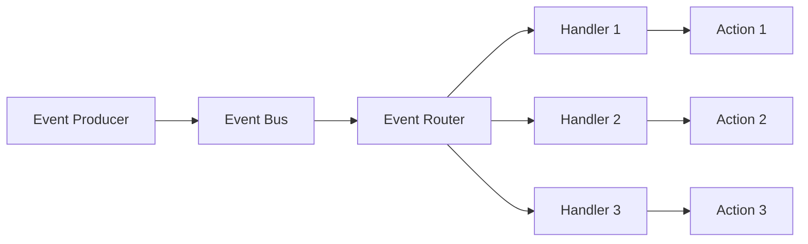

# 🏗️ Claude-Flow Architecture 문서

## 목차

- [시스템 개요](#시스템-개요)
- [핵심 Architecture](#핵심-architecture)
- [Component Architecture](#component-architecture)
- [데이터 흐름](#데이터-흐름)
- [Design Pattern](#design-pattern)
- [기술 스택](#기술-스택)
- [배포 Architecture](#배포-architecture)
- [보안 Architecture](#보안-architecture)
- [Performance Architecture](#performance-architecture)
- [확장성 설계](#확장성-설계)

---

## 시스템 개요

Claude-Flow는 이벤트 기반 통신을 사용하는 microservice architecture를 기반으로 구축되어 높은 확장성, 장애 허용성 및 확장 가능성을 제공하도록 설계되었습니다.

### High-Level Architecture

```
┌─────────────────────────────────────────────────────────────────┐
│                         Client Layer                             │
│  ┌──────────┐  ┌──────────┐  ┌──────────┐  ┌──────────┐       │
│  │   CLI    │  │   API    │  │WebSocket │  │   MCP    │       │
│  └──────────┘  └──────────┘  └──────────┘  └──────────┘       │
└─────────────────────────────────────────────────────────────────┘
                                │
┌─────────────────────────────────────────────────────────────────┐
│                      API Gateway Layer                           │
│  ┌─────────────────────────────────────────────────────────┐   │
│  │  Load Balancer │ Rate Limiter │ Auth │ Router          │   │
│  └─────────────────────────────────────────────────────────┘   │
└─────────────────────────────────────────────────────────────────┘
                                │
┌─────────────────────────────────────────────────────────────────┐
│                      Core Services Layer                         │
│  ┌──────────────┐  ┌──────────────┐  ┌──────────────┐         │
│  │ Orchestrator │  │Swarm Manager │  │Task Engine   │         │
│  └──────────────┘  └──────────────┘  └──────────────┘         │
│  ┌──────────────┐  ┌──────────────┐  ┌──────────────┐         │
│  │Agent Manager │  │Memory System │  │MCP Server    │         │
│  └──────────────┘  └──────────────┘  └──────────────┘         │
└─────────────────────────────────────────────────────────────────┘
                                │
┌─────────────────────────────────────────────────────────────────┐
│                    Infrastructure Layer                          │
│  ┌──────────────┐  ┌──────────────┐  ┌──────────────┐         │
│  │   Database   │  │Message Queue │  │Cache Layer   │         │
│  └──────────────┘  └──────────────┘  └──────────────┘         │
│  ┌──────────────┐  ┌──────────────┐  ┌──────────────┐         │
│  │File Storage  │  │Monitoring    │  │Logging       │         │
│  └──────────────┘  └──────────────┘  └──────────────┘         │
└─────────────────────────────────────────────────────────────────┘
```

### 주요 Architecture 원칙

1. **Microservice Architecture** - 느슨하게 결합되고 독립적으로 배포 가능한 service
2. **Event-Driven Design** - event bus를 통한 비동기 통신
3. **Domain-Driven Design** - 명확한 경계와 풍부한 domain model
4. **CQRS Pattern** - command와 query의 분리
5. **Hexagonal Architecture** - 외부 의존성을 위한 port와 adapter

---

## 핵심 Architecture

### Component Diagram



### 핵심 Component

#### 1. Orchestrator (`src/core/orchestrator.ts`)

모든 시스템 작업을 관리하는 중앙 조정 component입니다.

```typescript
class Orchestrator {
  private agentManager: AgentManager;
  private taskEngine: TaskEngine;
  private swarmCoordinator: SwarmCoordinator;
  private memoryManager: MemoryManager;
  private eventBus: EventBus;

  async initialize(): Promise<void> {
    // 모든 하위 시스템 초기화
    await this.memoryManager.initialize();
    await this.agentManager.initialize();
    await this.taskEngine.initialize();
    await this.swarmCoordinator.initialize();

    // Event handler 설정
    this.setupEventHandlers();
  }

  async executeTask(task: Task): Promise<TaskResult> {
    // Agent 조정을 통한 task 실행 로직
    const agent = await this.agentManager.selectAgent(task);
    const context = await this.memoryManager.getContext(task);
    return await agent.execute(task, context);
  }
}
```

#### 2. Agent Manager (`src/agents/manager.ts`)

AI agent의 라이프사이클과 조정을 관리합니다.

```typescript
class AgentManager {
  private agents: Map<string, Agent>;
  private pool: AgentPool;
  private selector: AgentSelector;

  async spawnAgent(config: AgentConfig): Promise<Agent> {
    const agent = await this.createAgent(config);
    await this.pool.add(agent);
    this.agents.set(agent.id, agent);
    return agent;
  }

  async selectAgent(task: Task): Promise<Agent> {
    return await this.selector.select(task, this.agents);
  }
}
```

#### 3. Task Engine (`src/task/engine.ts`)

Task scheduling, 실행 및 모니터링을 처리합니다.

```typescript
class TaskEngine {
  private queue: TaskQueue;
  private scheduler: TaskScheduler;
  private executor: TaskExecutor;

  async submitTask(task: Task): Promise<string> {
    await this.queue.enqueue(task);
    await this.scheduler.schedule(task);
    return task.id;
  }

  async executeTask(taskId: string): Promise<TaskResult> {
    const task = await this.queue.dequeue(taskId);
    return await this.executor.execute(task);
  }
}
```

#### 4. Swarm Coordinator (`src/swarm/coordinator.ts`)

다중 agent swarm 작업 및 topology를 관리합니다.

```typescript
class SwarmCoordinator {
  private topology: SwarmTopology;
  private agents: Agent[];
  private communicator: SwarmCommunicator;

  async initializeSwarm(config: SwarmConfig): Promise<Swarm> {
    this.topology = this.createTopology(config.topology);
    this.agents = await this.spawnAgents(config.agents);
    return new Swarm(this.topology, this.agents);
  }

  async coordinate(objective: string): Promise<SwarmResult> {
    const tasks = await this.decomposeTasks(objective);
    return await this.topology.execute(tasks, this.agents);
  }
}
```

#### 5. Memory Manager (`src/memory/manager.ts`)

영구 상태 및 지식을 위한 분산 memory 시스템입니다.

```typescript
class MemoryManager {
  private backend: MemoryBackend;
  private cache: MemoryCache;
  private indexer: MemoryIndexer;

  async store(key: string, value: any, options?: MemoryOptions): Promise<void> {
    await this.cache.set(key, value);
    await this.backend.store(key, value, options);
    await this.indexer.index(key, value);
  }

  async retrieve(key: string): Promise<any> {
    const cached = await this.cache.get(key);
    if (cached) return cached;

    const value = await this.backend.retrieve(key);
    await this.cache.set(key, value);
    return value;
  }
}
```

---

## Component Architecture

### Agent Architecture

```
┌─────────────────────────────────────────┐
│              Agent                       │
├─────────────────────────────────────────┤
│  Properties:                            │
│  - id: string                           │
│  - type: AgentType                      │
│  - status: AgentStatus                  │
│  - capabilities: Capability[]           │
├─────────────────────────────────────────┤
│  Methods:                               │
│  - execute(task: Task): TaskResult      │
│  - communicate(msg: Message): void      │
│  - updateStatus(status: Status): void   │
└─────────────────────────────────────────┘
              │
              ├── CoderAgent
              ├── ReviewerAgent
              ├── TesterAgent
              ├── ArchitectAgent
              └── [50+ 전문 agent]
```

### Task Architecture

```
┌─────────────────────────────────────────┐
│              Task                        │
├─────────────────────────────────────────┤
│  Properties:                            │
│  - id: string                           │
│  - type: TaskType                       │
│  - priority: Priority                   │
│  - status: TaskStatus                   │
│  - dependencies: Task[]                 │
├─────────────────────────────────────────┤
│  Methods:                               │
│  - validate(): boolean                  │
│  - execute(): TaskResult                │
│  - rollback(): void                     │
└─────────────────────────────────────────┘
```

### Swarm Topology

Claude-Flow는 실시간 적응을 통한 정교한 swarm 조정 pattern을 구현합니다:

#### 1. Centralized (Queen-Led) Topology

```
         ┌──────────────────┐
         │   Queen Agent    │
         │ ┌──────────────┐ │
         │ │ Consensus    │ │
         │ │ Engine       │ │
         │ └──────────────┘ │
         └─────────┬────────┘
                   │ Commands
    ┌──────────────┼──────────────┐
    │              │              │
┌───▼────┐   ┌────▼────┐   ┌────▼────┐
│Worker1 │   │Worker2  │   │Worker3  │
│(Coder) │   │(Tester) │   │(Review) │
└───┬────┘   └────┬────┘   └────┬────┘
    │             │             │
    └─────────────┼─────────────┘
                  ▼ Results
         ┌─────────────────┐
         │ Result Aggr.    │
         └─────────────────┘
```

**특징:**
- 66% threshold를 갖춘 Byzantine fault tolerance
- Consensus 기반 task 할당
- 중앙집중식 결과 집계
- Performance: 2.8-4.4배 속도 향상

#### 2. Mesh (Peer-to-Peer) Topology

```
┌─────────────┐     ┌─────────────┐
│   Agent1    │◄───►│   Agent2    │
│ Researcher  │     │  Architect  │
└─────┬───────┘     └─────┬───────┘
      │       ╳             │
      │     ╱   ╲           │
      │   ╱       ╲         │
┌─────▼─────┐     ┌───────▼─┐
│  Agent3   │◄───►│  Agent4 │
│  Coder    │     │  Monitor│
└───────────┘     └─────────┘
```

**특징:**
- 투표를 통한 분산 consensus
- Message routing을 갖춘 P2P 통신
- 적응형 load balancing
- Circuit breaker를 갖춘 fault-tolerant

#### 3. Hierarchical (Multi-Level) Topology

```
              ┌─────────────────────┐
              │   Root Coordinator  │
              │  ┌───────────────┐  │
              │  │ Neural Pattern│  │
              │  │ & Memory Mgmt │  │
              │  └───────────────┘  │
              └──────────┬──────────┘
                         │
            ┌────────────┴────────────┐
            │                         │
      ┌─────▼──────┐           ┌─────▼──────┐
      │ Manager1   │           │ Manager2   │
      │(Frontend)  │           │(Backend)   │
      └─────┬──────┘           └─────┬──────┘
            │                         │
     ┌──────┴──────┐           ┌──────┴──────┐
     │             │           │             │
┌────▼────┐   ┌───▼────┐  ┌───▼────┐   ┌───▼────┐
│React    │   │Mobile  │  │API     │   │Database│
│Agent    │   │Agent   │  │Agent   │   │Agent   │
└─────────┘   └────────┘  └────────┘   └────────┘
```

**특징:**
- 다층 command 계층
- Domain별 agent cluster
- Resource pooling 및 최적화
- 클러스터 간 통신

#### 4. Distributed (Cloud-Native) Topology

```
┌─────────────────────────────────────────────────────┐
│              Load Balancer                          │
└─────────────────┬───────────────────────────────────┘
                  │
     ┌────────────┼────────────┐
     │            │            │
┌────▼────┐  ┌───▼────┐  ┌───▼────┐
│Region 1 │  │Region 2│  │Region 3│
│ ┌─────┐ │  │ ┌─────┐│  │ ┌─────┐│
│ │Agent│ │  │ │Agent││  │ │Agent││
│ │Pool │ │  │ │Pool ││  │ │Pool ││
│ └─────┘ │  │ └─────┘│  │ └─────┘│
└─────────┘  └────────┘  └────────┘
     │            │            │
     └────────────┼────────────┘
                  ▼
      ┌─────────────────────┐
      │ Distributed Memory  │
      │ & State Management  │
      └─────────────────────┘
```

**특징:**
- 지리적 분산
- 부하 기반 auto-scaling
- 분산 상태 동기화
- Edge computing 기능

---

## 데이터 흐름

### Request 처리 흐름



### Event 흐름



---

## Design Pattern

### 1. Repository Pattern

```typescript
interface Repository<T> {
  findById(id: string): Promise<T>;
  findAll(): Promise<T[]>;
  save(entity: T): Promise<void>;
  delete(id: string): Promise<void>;
}

class AgentRepository implements Repository<Agent> {
  constructor(private db: Database) {}

  async findById(id: string): Promise<Agent> {
    const data = await this.db.query('SELECT * FROM agents WHERE id = ?', [id]);
    return this.mapToAgent(data);
  }

  async save(agent: Agent): Promise<void> {
    await this.db.execute(
      'INSERT OR REPLACE INTO agents VALUES (?, ?, ?, ?)',
      [agent.id, agent.type, agent.status, JSON.stringify(agent.config)]
    );
  }
}
```

### 2. Strategy Pattern

```typescript
interface CoordinationStrategy {
  coordinate(agents: Agent[], tasks: Task[]): Promise<ExecutionPlan>;
}

class CentralizedStrategy implements CoordinationStrategy {
  async coordinate(agents: Agent[], tasks: Task[]): Promise<ExecutionPlan> {
    // Queen-led 조정 로직
  }
}

class MeshStrategy implements CoordinationStrategy {
  async coordinate(agents: Agent[], tasks: Task[]): Promise<ExecutionPlan> {
    // Peer-to-peer 조정 로직
  }
}

class SwarmCoordinator {
  constructor(private strategy: CoordinationStrategy) {}

  async execute(agents: Agent[], tasks: Task[]): Promise<void> {
    const plan = await this.strategy.coordinate(agents, tasks);
    await this.executePlan(plan);
  }
}
```

### 3. Observer Pattern

```typescript
interface Observer {
  update(event: Event): void;
}

class EventBus {
  private observers: Map<string, Observer[]> = new Map();

  subscribe(eventType: string, observer: Observer): void {
    if (!this.observers.has(eventType)) {
      this.observers.set(eventType, []);
    }
    this.observers.get(eventType)!.push(observer);
  }

  publish(event: Event): void {
    const observers = this.observers.get(event.type) || [];
    observers.forEach(observer => observer.update(event));
  }
}
```

### 4. Factory Pattern

```typescript
abstract class AgentFactory {
  abstract createAgent(type: string): Agent;

  spawn(type: string, config: AgentConfig): Agent {
    const agent = this.createAgent(type);
    agent.configure(config);
    return agent;
  }
}

class SpecializedAgentFactory extends AgentFactory {
  createAgent(type: string): Agent {
    switch(type) {
      case 'coder': return new CoderAgent();
      case 'reviewer': return new ReviewerAgent();
      case 'tester': return new TesterAgent();
      default: throw new Error(`Unknown agent type: ${type}`);
    }
  }
}
```

### 5. Decorator Pattern

```typescript
interface Agent {
  execute(task: Task): Promise<TaskResult>;
}

class BaseAgent implements Agent {
  async execute(task: Task): Promise<TaskResult> {
    // 기본 실행 로직
  }
}

class LoggingDecorator implements Agent {
  constructor(private agent: Agent) {}

  async execute(task: Task): Promise<TaskResult> {
    console.log(`Starting task: ${task.id}`);
    const result = await this.agent.execute(task);
    console.log(`Completed task: ${task.id}`);
    return result;
  }
}

class MetricsDecorator implements Agent {
  constructor(private agent: Agent) {}

  async execute(task: Task): Promise<TaskResult> {
    const start = Date.now();
    const result = await this.agent.execute(task);
    const duration = Date.now() - start;
    await this.recordMetrics(task.id, duration);
    return result;
  }
}
```

---

## 기술 스택

### 핵심 기술

| Layer | Technology | Version | Purpose |
|-------|------------|---------|---------|
| Runtime | Node.js | v20.0.0+ | ES2022+ 기능을 갖춘 JavaScript runtime |
| Language | TypeScript | v5.3.3 | 고급 generic을 사용한 type-safe 개발 |
| Framework | Custom ESM | v2.0.0-alpha.88 | 경량 모듈식 architecture |
| Database | SQLite | v3.40+ | WAL 모드를 갖춘 embedded database |
| Database Driver | better-sqlite3 | v12.2.0 | 고성능 SQLite driver |
| Cache | In-memory + TTL | Custom | TTL 지원을 갖춘 다층 caching |
| Queue | P-Queue | v8.1.0 | 우선순위를 갖춘 고급 task queue |
| CLI | Commander.js | v11.1.0 | Command-line interface framework |
| API | Express | v5.1.0 | 최신 기능을 갖춘 REST API server |
| WebSocket | ws | v8.18.3 | 실시간 양방향 통신 |
| Testing | Jest | v29.7.0 | 종합 testing framework |
| Swarm Engine | ruv-swarm | v1.0.14 | 다중 agent 조정 시스템 |
| MCP Protocol | @modelcontextprotocol/sdk | v1.0.4 | Model Context Protocol 통합 |

### 의존성

#### 핵심 의존성

```json
{
  "@modelcontextprotocol/sdk": "^1.0.4",
  "better-sqlite3": "^12.2.0",
  "commander": "^11.1.0",
  "express": "^5.1.0",
  "ws": "^8.18.3",
  "yaml": "^2.8.0"
}
```

#### 개발 의존성

```json
{
  "@types/node": "^20.19.7",
  "typescript": "^5.3.3",
  "jest": "^29.7.0",
  "eslint": "^8.57.1",
  "prettier": "^3.1.1"
}
```

### 파일 구조

```
claude-flow/
├── src/
│   ├── core/           # 핵심 orchestration 로직
│   ├── agents/         # Agent 구현
│   ├── swarm/          # Swarm 조정
│   ├── task/           # Task 관리
│   ├── memory/         # Memory 시스템
│   ├── providers/      # LLM provider
│   ├── api/            # REST API
│   ├── cli/            # CLI command
│   ├── mcp/            # MCP protocol
│   ├── utils/          # Utility
│   └── types/          # TypeScript type
├── tests/              # Test suite
├── docs/               # 문서
├── examples/           # 예제 code
└── scripts/            # Build & deploy script
```

---

## 배포 Architecture

### Container Architecture

```dockerfile
# Multi-stage build
FROM node:20-alpine AS builder
WORKDIR /app
COPY package*.json ./
RUN npm ci
COPY . .
RUN npm run build

FROM node:20-alpine AS runtime
WORKDIR /app
COPY --from=builder /app/dist ./dist
COPY --from=builder /app/node_modules ./node_modules
COPY package*.json ./
EXPOSE 3000
CMD ["node", "dist/index.js"]
```

### Kubernetes Deployment

```yaml
apiVersion: apps/v1
kind: Deployment
metadata:
  name: claude-flow
spec:
  replicas: 3
  selector:
    matchLabels:
      app: claude-flow
  template:
    metadata:
      labels:
        app: claude-flow
    spec:
      containers:
      - name: claude-flow
        image: claude-flow:latest
        ports:
        - containerPort: 3000
        resources:
          requests:
            memory: "512Mi"
            cpu: "500m"
          limits:
            memory: "2Gi"
            cpu: "2000m"
        env:
        - name: NODE_ENV
          value: "production"
        livenessProbe:
          httpGet:
            path: /health
            port: 3000
          initialDelaySeconds: 30
          periodSeconds: 10
        readinessProbe:
          httpGet:
            path: /ready
            port: 3000
          initialDelaySeconds: 5
          periodSeconds: 5
```

### Cloud Architecture

```
┌─────────────────────────────────────────────────────┐
│                   CDN Layer                         │
│              (CloudFlare/Fastly)                    │
└─────────────────────────────────────────────────────┘
                        │
┌─────────────────────────────────────────────────────┐
│              Load Balancer (ALB)                    │
└─────────────────────────────────────────────────────┘
                        │
┌─────────────────────────────────────────────────────┐
│           Auto-Scaling Group (ASG)                  │
│  ┌──────────┐  ┌──────────┐  ┌──────────┐         │
│  │Instance 1│  │Instance 2│  │Instance 3│         │
│  └──────────┘  └──────────┘  └──────────┘         │
└─────────────────────────────────────────────────────┘
                        │
┌─────────────────────────────────────────────────────┐
│              Managed Services                       │
│  ┌──────────┐  ┌──────────┐  ┌──────────┐         │
│  │    RDS   │  │   Redis  │  │    S3    │         │
│  └──────────┘  └──────────┘  └──────────┘         │
└─────────────────────────────────────────────────────┘
```

---

## 보안 Architecture

### 보안 계층

```
┌─────────────────────────────────────────────────────┐
│              Application Layer                       │
│  - Input validation                                 │
│  - Output encoding                                  │
│  - CSRF protection                                  │
└─────────────────────────────────────────────────────┘
                        │
┌─────────────────────────────────────────────────────┐
│            Authentication Layer                      │
│  - JWT token                                        │
│  - API key                                          │
│  - OAuth 2.0                                        │
└─────────────────────────────────────────────────────┘
                        │
┌─────────────────────────────────────────────────────┐
│           Authorization Layer                        │
│  - Role-based access control (RBAC)                 │
│  - Attribute-based access control (ABAC)            │
│  - Policy engine                                    │
└─────────────────────────────────────────────────────┘
                        │
┌─────────────────────────────────────────────────────┐
│              Network Layer                           │
│  - TLS/SSL encryption                               │
│  - VPC isolation                                    │
│  - Security group                                   │
└─────────────────────────────────────────────────────┘
```

이 문서는 계속됩니다... (파일이 매우 크므로 분할 저장이 필요합니다)
