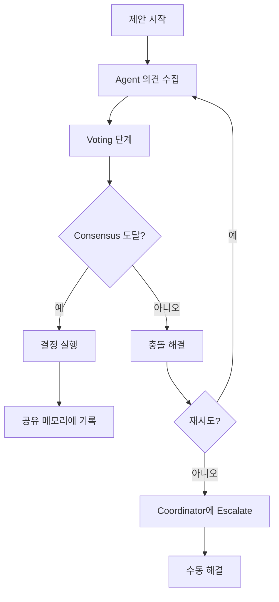

# Claude Flow Swarm Intelligence 문서

## 목차

- [개요](#개요)
- [핵심 개념](#핵심-개념)
- [Topology 타입](#topology-타입)
- [Consensus 메커니즘](#consensus-메커니즘)
- [Byzantine Fault Tolerance](#byzantine-fault-tolerance)
- [분산 메모리 관리](#분산-메모리-관리)
- [성능 Metrics](#성능-metrics)
- [명령어 참조](#명령어-참조)
- [구성 예제](#구성-예제)
- [실제 사용 사례](#실제-사용-사례)
- [모범 사례](#모범-사례)
- [문제 해결](#문제-해결)

## 개요

Claude Flow Swarm Intelligence 시스템은 복잡한 작업을 해결하기 위해 협업하는 특화된 AI agent의 자기 조정 네트워크를 가능하게 합니다. 이 시스템은 분산 조정 패턴, consensus 메커니즘 및 fault-tolerant architecture를 구현하여 강력하고 확장 가능한 AI agent 네트워크를 생성합니다.

### 주요 기능

- **다중 Topology 지원**: 중앙 집중식, 분산, mesh, 계층적 및 하이브리드 구성
- **Byzantine Fault Tolerance**: Agent 장애 및 악의적인 행동에 대한 복원력
- **Consensus 메커니즘**: 민주적 의사 결정 및 집단 지능
- **분산 메모리**: 공유 지식 및 조정 상태
- **성능 모니터링**: 실시간 metrics 및 최적화
- **동적 확장**: 자동 agent 생성 및 부하 분산

## 핵심 개념

### Swarm Architecture

Swarm은 다음으로 구성됩니다:

1. **Master Orchestrator**: 전체 swarm 작업 조정
2. **특화된 Agent**: 특정 기능을 가진 개별 AI 인스턴스
3. **통신 Layer**: Agent 간 통신을 위한 메시지 버스
4. **공유 메모리**: 분산 지식 및 상태 관리
5. **Consensus Engine**: 민주적 의사 결정 시스템
6. **리소스 관리자**: 컴퓨팅 및 메모리 할당

### Agent 타입

```typescript
export type AgentType =
  | 'coordinator'      // 다른 agent 오케스트레이션 및 관리
  | 'researcher'       // 연구 및 데이터 수집 수행
  | 'coder'           // 코드 작성 및 유지보수
  | 'analyst'         // 데이터 분석 및 인사이트 생성
  | 'architect'       // 시스템 architecture 설계
  | 'tester'          // 기능 테스트 및 검증
  | 'reviewer'        // 작업 리뷰 및 검증
  | 'optimizer'       // 성능 최적화
  | 'documenter'      // 문서 작성
  | 'monitor'         // 시스템 상태 모니터링
  | 'specialist'      // 도메인별 전문성
```

### Agent 기능

각 agent는 작업 할당을 결정하는 정의된 기능을 가집니다:

```typescript
interface AgentCapabilities {
  // 핵심 기능
  codeGeneration: boolean;
  codeReview: boolean;
  testing: boolean;
  documentation: boolean;
  research: boolean;
  analysis: boolean;

  // 통신
  webSearch: boolean;
  apiIntegration: boolean;
  fileSystem: boolean;
  terminalAccess: boolean;

  // 특화
  languages: string[];     // 프로그래밍 언어
  frameworks: string[];    // Framework 및 라이브러리
  domains: string[];       // 도메인 전문성
  tools: string[];         // 사용 가능한 tool

  // 성능 제한
  maxConcurrentTasks: number;
  reliability: number;     // 0-1 신뢰도 점수
  speed: number;           // 상대 속도 등급
  quality: number;         // 품질 등급
}
```

## Topology 타입

### 1. 중앙 집중식 Topology

**구조**: 단일 coordinator가 모든 agent 관리
**적합 대상**: 간단한 작업, 명확한 계층 구조, 강력한 조정 필요

```typescript
interface CentralizedConfig {
  topology: 'centralized';
  coordinator: {
    type: 'master-coordinator';
    capabilities: ['task_management', 'resource_allocation'];
  };
  agents: AgentConfig[];
  communication: 'hub-and-spoke';
}
```

**장점**:
- 간단한 조정
- 명확한 권한 구조
- 쉬운 디버깅 및 모니터링
- 일관된 의사 결정

**단점**:
- 단일 장애 지점
- Coordinator에서 병목 현상
- 제한된 확장성
- 감소된 fault tolerance

### 2. 분산 Topology

**구조**: 여러 coordinator가 관리 책임 공유
**적합 대상**: 대규모 작업, fault tolerance, 지리적 분산

```typescript
interface DistributedConfig {
  topology: 'distributed';
  coordinators: CoordinatorConfig[];
  loadBalancing: 'round-robin' | 'capability-based' | 'workload-balanced';
  consensusRequired: boolean;
  partitioning: 'task-based' | 'agent-based' | 'geographic';
}
```

**장점**:
- 높은 fault tolerance
- 뛰어난 확장성
- 부하 분산
- 지리적 복원력

**단점**:
- 복잡한 조정
- Consistency 문제
- 네트워크 오버헤드
- 더 어려운 디버깅

### 3. Mesh Topology

**구조**: 직접 통신을 통한 peer-to-peer agent 네트워크
**적합 대상**: 협업 작업, consensus 기반 결정, 연구 프로젝트

```typescript
interface MeshConfig {
  topology: 'mesh';
  connectionStrategy: 'full-mesh' | 'partial-mesh' | 'ring-mesh';
  consensusAlgorithm: 'raft' | 'pbft' | 'pos';
  communicationProtocol: 'gossip' | 'broadcast' | 'multicast';
  redundancyLevel: number; // 1-5
}
```

**장점**:
- 민주적 의사 결정
- 높은 중복성
- 자기 조직화
- 장애에 대한 복원력

**단점**:
- 높은 통신 오버헤드
- 대규모 네트워크에서의 복잡성
- Consensus가 느릴 수 있음
- 리소스 집약적

### 4. 계층적 Topology

**구조**: 여러 조정 수준을 가진 트리 구조
**적합 대상**: 복잡한 프로젝트, 명확한 작업 분해, 엔터프라이즈 시나리오

```typescript
interface HierarchicalConfig {
  topology: 'hierarchical';
  levels: {
    executives: CoordinatorConfig[];    // 최상위 전략
    managers: CoordinatorConfig[];      // 중간 수준 조정
    workers: AgentConfig[];             // 작업 실행
  };
  spanOfControl: number;                // 최대 직접 보고
  escalationRules: EscalationRule[];
}
```

**장점**:
- 명확한 책임 체인
- 복잡한 작업에 효율적
- 우수한 확장성
- 자연스러운 작업 위임

**단점**:
- 경직된 구조
- 수준별 잠재적 병목 현상
- 느린 적응
- 통신 지연

### 5. 하이브리드 Topology

**구조**: 최적의 성능을 위해 여러 topology 결합
**적합 대상**: 다양한 요구사항을 가진 복잡한 다단계 프로젝트

```typescript
interface HybridConfig {
  topology: 'hybrid';
  phases: {
    planning: 'centralized';     // 중앙 집중식 계획
    execution: 'distributed';    // 분산 실행
    integration: 'hierarchical'; // 계층적 통합
    review: 'mesh';              // Mesh 기반 peer 리뷰
  };
  dynamicReconfiguration: boolean;
  adaptationTriggers: string[];
}
```

**장점**:
- 각 단계에 최적
- 최대 유연성
- 최상의 성능 특성
- 변화하는 요구사항에 적응

**단점**:
- 구현이 가장 복잡함
- 정교한 조정 필요
- 더 높은 리소스 요구사항
- 행동 예측이 더 어려움

## Consensus 메커니즘

### 1. Voting 시스템

#### 단순 다수 Voting
```typescript
interface MajorityVoting {
  type: 'majority';
  threshold: 0.5;           // 50% + 1
  eligibleVoters: AgentId[];
  votingPeriod: number;     // 밀리초
  tieBreaking: 'random' | 'coordinator' | 'expertise-weighted';
}
```

#### 가중 Voting
```typescript
interface WeightedVoting {
  type: 'weighted';
  weights: Map<AgentId, number>;  // Agent 전문성 가중치
  threshold: number;               // 가중 임계값
  weightingFactors: {
    expertise: number;
    reliability: number;
    performance: number;
  };
}
```

#### Supermajority Voting
```typescript
interface SupermajorityVoting {
  type: 'supermajority';
  threshold: 0.67;          // 2/3 다수
  criticalDecisions: boolean;
  fallbackToMajority: boolean;
}
```

### 2. Consensus 알고리즘

#### Raft Consensus
```typescript
interface RaftConfig {
  algorithm: 'raft';
  electionTimeout: number;
  heartbeatInterval: number;
  logReplication: boolean;
  leaderElection: {
    enabled: boolean;
    termDuration: number;
    candidateTimeout: number;
  };
}
```

사용법:
```bash
claude-flow swarm "Complex decision task" \
  --topology mesh \
  --consensus raft \
  --election-timeout 5000
```

#### Practical Byzantine Fault Tolerance (PBFT)
```typescript
interface PBFTConfig {
  algorithm: 'pbft';
  byzantineTolerance: number;  // f = (n-1)/3 Byzantine 노드
  viewChangeTimeout: number;
  prepareThreshold: number;
  commitThreshold: number;
  checkpointInterval: number;
}
```

#### Proof of Stake (PoS)
```typescript
interface PoSConfig {
  algorithm: 'pos';
  stakingMechanism: 'performance' | 'reliability' | 'expertise';
  minimumStake: number;
  slashingConditions: string[];
  rewardDistribution: 'proportional' | 'equal';
}
```

### 3. Consensus 프로세스 흐름



## Byzantine Fault Tolerance

### Byzantine 장애 이해

Byzantine 장애는 다음과 같은 경우에 발생합니다:
- 잘못되거나 악의적인 응답 제공
- 예측할 수 없거나 일관성 없게 행동
- Swarm 목표를 훼손하려고 시도
- 상태를 손상시키는 부분 장애 경험

### Byzantine Fault Tolerance 메커니즘

#### 1. Agent 인증 및 신뢰

```typescript
interface TrustManagement {
  authentication: {
    method: 'signature' | 'certificate' | 'token';
    rotationInterval: number;
    revocationList: AgentId[];
  };
  trustScores: Map<AgentId, TrustScore>;
  suspiciousActivityDetection: boolean;
  quarantinePolicy: {
    threshold: number;
    duration: number;
    reviewProcess: boolean;
  };
}

interface TrustScore {
  reliability: number;      // 0-1 과거 성능 기반
  consistency: number;      // 0-1 행동 일관성
  expertise: number;        // 0-1 도메인 전문성
  timeDecay: number;        // 시간 경과에 따른 신뢰 저하
}
```

#### 2. 응답 검증

```typescript
interface ResponseValidation {
  crossValidation: {
    enabled: boolean;
    minimumValidators: number;
    agreementThreshold: number;
  };

  outputVerification: {
    codeExecution: boolean;
    logicValidation: boolean;
    formatChecking: boolean;
  };

  consistencyChecks: {
    previousResponses: boolean;
    expertiseAlignment: boolean;
    timeConstraints: boolean;
  };
}
```

#### 3. 중복성 및 백업 시스템

```typescript
interface RedundancyConfig {
  taskReplication: {
    factor: number;           // 같은 작업을 수행하는 agent 수
    diversityRequirement: boolean; // 다른 agent 타입 요구
    independentExecution: boolean;
  };

  resultAggregation: {
    method: 'voting' | 'averaging' | 'best-of-n';
    outlierDetection: boolean;
    qualityWeighting: boolean;
  };

  fallbackMechanisms: {
    degradedMode: boolean;    // 감소된 기능으로 계속
    humanIntervention: boolean;
    alternativeApproaches: string[];
  };
}
```

#### 4. 모니터링 및 탐지

```typescript
interface ByzantineDetection {
  anomalyDetection: {
    responseTime: { min: number; max: number };
    qualityMetrics: { threshold: number };
    behaviorPatterns: string[];
  };

  votingPatternAnalysis: {
    enabled: boolean;
    suspiciousPatterns: string[];
    collisionDetection: boolean;
  };

  alerting: {
    realTime: boolean;
    thresholds: Map<string, number>;
    escalationProcedure: string[];
  };
}
```

### 구현 예제

```bash
# Byzantine fault-tolerant swarm 시작
claude-flow swarm "Critical system analysis" \
  --topology mesh \
  --byzantine-tolerance 3 \
  --consensus pbft \
  --trust-management enabled \
  --redundancy-factor 5 \
  --cross-validation 3
```

구성:
```json
{
  "swarmConfig": {
    "topology": "mesh",
    "byzantineTolerance": {
      "enabled": true,
      "maxByzantineNodes": 3,
      "detectionThreshold": 0.7,
      "quarantineEnabled": true
    },
    "consensus": {
      "algorithm": "pbft",
      "threshold": 0.67,
      "validationRounds": 2
    },
    "redundancy": {
      "taskReplication": 5,
      "resultAggregation": "weighted-voting",
      "fallbackEnabled": true
    }
  }
}
```

## 분산 메모리 관리

### Architecture 개요

분산 메모리 시스템은 모든 swarm agent에게 공유 지식 및 조정 상태를 제공합니다.

```typescript
interface DistributedMemoryConfig {
  backend: 'sqlite' | 'mongodb' | 'redis' | 'hybrid';
  replication: {
    enabled: boolean;
    factor: number;           // Replica 수
    strategy: 'master-slave' | 'multi-master' | 'raft';
    consistencyLevel: 'eventual' | 'strong' | 'bounded';
  };

  partitioning: {
    enabled: boolean;
    strategy: 'key-hash' | 'range' | 'directory';
    shardCount: number;
  };

  caching: {
    enabled: boolean;
    levels: ('l1' | 'l2' | 'l3')[];
    evictionPolicy: 'lru' | 'lfu' | 'ttl';
    sizeLimitMB: number;
  };
}
```

### 메모리 타입

#### 1. 공유 지식 베이스

집단 지능 및 학습된 패턴 저장:

```typescript
interface KnowledgeEntry {
  id: string;
  type: 'fact' | 'pattern' | 'solution' | 'heuristic';
  domain: string;
  content: any;
  confidence: number;       // 0-1 신뢰도 점수
  sources: AgentId[];       // 기여한 agent
  validations: number;      // 검증 수
  timestamp: Date;
  expirationDate?: Date;
  tags: string[];
}
```

#### 2. 작업 조정 상태

분산 작업 실행 관리:

```typescript
interface TaskState {
  taskId: string;
  status: 'pending' | 'assigned' | 'in-progress' | 'completed' | 'failed';
  assignedAgents: AgentId[];
  dependencies: string[];
  progress: number;         // 0-100 완료 백분율
  checkpoints: Checkpoint[];
  results: TaskResult[];
  locks: ResourceLock[];
}
```

#### 3. Agent 통신 기록

메시지 로그 및 상호작용 패턴 유지:

```typescript
interface CommunicationLog {
  messageId: string;
  sender: AgentId;
  recipients: AgentId[];
  type: 'request' | 'response' | 'broadcast' | 'notification';
  content: any;
  timestamp: Date;
  acknowledged: AgentId[];
  priority: 'low' | 'normal' | 'high' | 'critical';
}
```

### 동기화 전략

#### 1. Eventually Consistent (CAP 정리에서 AP)

```typescript
interface EventualConsistency {
  strategy: 'eventual';
  propagationDelay: number;     // 업데이트의 최대 지연
  conflictResolution: 'last-write-wins' | 'vector-clocks' | 'operational-transform';
  antiEntropyInterval: number;  // 백그라운드 동기화 빈도
}
```

#### 2. Strong Consistency (CAP 정리에서 CP)

```typescript
interface StrongConsistency {
  strategy: 'strong';
  consensusRequired: boolean;
  quorumSize: number;          // 작업을 위한 최소 노드
  timeoutMs: number;           // 작업 timeout
  rollbackOnFailure: boolean;
}
```

#### 3. Bounded Staleness

```typescript
interface BoundedStaleness {
  strategy: 'bounded';
  maxStalenessMs: number;      // 허용되는 최대 staleness
  consistencyCheckInterval: number;
  repairMechanism: 'read-repair' | 'write-repair' | 'periodic';
}
```

### 메모리 작업

#### 기본 작업

```typescript
// 데이터 저장
await memory.store({
  key: 'task:analysis:results',
  value: analysisResults,
  namespace: 'swarm-123',
  ttl: 3600000,  // 1시간
  replicate: true
});

// 데이터 검색
const results = await memory.retrieve({
  key: 'task:analysis:results',
  namespace: 'swarm-123',
  consistency: 'strong'
});

// 충돌 해결로 업데이트
await memory.update({
  key: 'agent:coordinator:state',
  updateFn: (currentValue) => ({
    ...currentValue,
    lastActivity: new Date(),
    taskCount: currentValue.taskCount + 1
  }),
  conflictResolution: 'merge'
});
```

#### 고급 작업

```typescript
// 분산 lock
const lock = await memory.acquireLock({
  resource: 'task:critical-section',
  timeout: 30000,
  owner: agentId
});

try {
  // Critical section 작업
  await performCriticalWork();
} finally {
  await memory.releaseLock(lock);
}

// Publish-subscribe 메시징
await memory.subscribe({
  channel: 'task:updates',
  handler: (message) => {
    console.log('Task update received:', message);
  }
});

await memory.publish({
  channel: 'task:updates',
  message: { type: 'completed', taskId: 'task-123' }
});
```

### 구성 예제

#### 고성능 구성

```json
{
  "distributedMemory": {
    "backend": "redis",
    "replication": {
      "enabled": true,
      "factor": 3,
      "strategy": "multi-master",
      "consistencyLevel": "eventual"
    },
    "caching": {
      "enabled": true,
      "levels": ["l1", "l2"],
      "sizeLimitMB": 512
    },
    "partitioning": {
      "enabled": true,
      "strategy": "key-hash",
      "shardCount": 16
    }
  }
}
```

#### 높은 일관성 구성

```json
{
  "distributedMemory": {
    "backend": "mongodb",
    "replication": {
      "enabled": true,
      "factor": 5,
      "strategy": "raft",
      "consistencyLevel": "strong"
    },
    "operations": {
      "quorumSize": 3,
      "timeoutMs": 5000,
      "rollbackOnFailure": true
    }
  }
}
```

## 성능 Metrics

### 시스템 수준 Metrics

#### 1. 처리량 Metrics

```typescript
interface ThroughputMetrics {
  tasksPerSecond: number;
  tasksPerHour: number;
  peakThroughput: number;
  averageThroughput: number;

  // 작업 타입별 분류
  throughputByType: Map<string, number>;

  // 시계열 데이터
  throughputHistory: TimeSeriesPoint[];
}
```

#### 2. 지연 시간 Metrics

```typescript
interface LatencyMetrics {
  averageLatency: number;
  p50Latency: number;       // 50번째 백분위수
  p95Latency: number;       // 95번째 백분위수
  p99Latency: number;       // 99번째 백분위수
  maxLatency: number;

  // 구성 요소 분류
  coordinationLatency: number;
  executionLatency: number;
  communicationLatency: number;
  memoryLatency: number;
}
```

#### 3. 리소스 활용

```typescript
interface ResourceMetrics {
  cpu: {
    usage: number;          // 0-100 백분율
    cores: number;
    frequency: number;
  };

  memory: {
    used: number;           // 바이트
    available: number;
    percentage: number;
    swapUsed: number;
  };

  network: {
    bytesIn: number;
    bytesOut: number;
    packetsIn: number;
    packetsOut: number;
    bandwidth: number;
  };

  storage: {
    readIops: number;
    writeIops: number;
    readThroughput: number;
    writeThroughput: number;
    diskUsage: number;
  };
}
```

### Agent 수준 Metrics

#### 1. 성능 Metrics

```typescript
interface AgentPerformanceMetrics {
  agentId: AgentId;

  // 작업 실행
  tasksCompleted: number;
  tasksFailed: number;
  successRate: number;
  averageExecutionTime: number;

  // 품질 metrics
  codeQuality: number;      // 0-1 점수
  testCoverage: number;     // 0-100 백분율
  bugRate: number;          // 1000 LOC당 버그
  reviewScore: number;      // Peer 리뷰 점수

  // 효율성 metrics
  resourceEfficiency: number; // 리소스 단위당 작업
  timeEfficiency: number;     // 실제 vs 예상 시간
  costEfficiency: number;     // 비용당 전달 가치
}
```

#### 2. 신뢰성 Metrics

```typescript
interface AgentReliabilityMetrics {
  uptime: number;           // 백분율
  mttr: number;             // Mean time to recovery (ms)
  mtbf: number;             // Mean time between failures (ms)

  errorRate: number;        // 시간당 오류
  timeoutRate: number;      // Timeout 백분율
  crashCount: number;       // 충돌 수

  healthScore: number;      // 0-1 전체 상태
  lastHealthCheck: Date;
  healthTrend: 'improving' | 'stable' | 'degrading';
}
```

### Swarm 수준 Metrics

#### 1. 조정 효율성

```typescript
interface CoordinationMetrics {
  consensusSuccessRate: number;
  consensusTime: number;            // Consensus 도달의 평균 시간
  communicationEfficiency: number;  // 유용한 메시지 / 총 메시지

  taskDistribution: {
    loadBalance: number;            // 0-1 얼마나 균등하게 분산되었는지
    utilizationRate: number;        // 활성 agent / 총 agent
    queueLength: number;            // 대기 중인 작업
  };

  conflictResolution: {
    conflictRate: number;           // 시간당 충돌
    resolutionTime: number;         // 평균 해결 시간
    escalationRate: number;         // Escalate된 충돌 백분율
  };
}
```

#### 2. 창발적 지능

```typescript
interface IntelligenceMetrics {
  knowledgeGrowthRate: number;      // 일일 새 지식
  patternRecognitionSuccess: number; // 성공한 패턴 매칭
  adaptabilityScore: number;        // 변화하는 조건에 대한 반응

  collectiveProblemSolving: {
    solutionQuality: number;        // 0-1 품질 점수
    innovationRate: number;         // 문제당 새로운 솔루션
    learningVelocity: number;       // 지식 획득 속도
  };

  emergentBehaviors: {
    selfOrganizationLevel: number;  // 0-1 자기 조직화 점수
    synergisticEffects: number;     // 부분의 합을 넘어서는 성능
    adaptiveCapacity: number;       // 새 작업에 적응하는 능력
  };
}
```

### 모니터링 및 Alerting

#### 실시간 대시보드

```typescript
interface DashboardConfig {
  refreshInterval: number;          // 밀리초

  panels: {
    systemOverview: boolean;
    agentStatus: boolean;
    taskProgress: boolean;
    resourceUtilization: boolean;
    performanceMetrics: boolean;
    alertSummary: boolean;
  };

  timeRanges: ('1h' | '6h' | '24h' | '7d' | '30d')[];
  aggregationLevels: ('second' | 'minute' | 'hour' | 'day')[];
}
```

#### Alert 구성

```typescript
interface AlertConfig {
  rules: AlertRule[];
  channels: AlertChannel[];
  suppressionRules: SuppressionRule[];
}

interface AlertRule {
  name: string;
  metric: string;
  operator: '>' | '<' | '>=' | '<=' | '==' | '!=';
  threshold: number;
  duration: number;             // 조건이 지속되어야 하는 시간
  severity: 'info' | 'warning' | 'critical' | 'emergency';
  description: string;
}

interface AlertChannel {
  type: 'email' | 'slack' | 'webhook' | 'console';
  config: Record<string, any>;
  severityFilter: string[];
}
```

## 명령어 참조

### 핵심 명령어

#### Swarm 초기화

```bash
# 기본 초기화
claude-flow swarm init --topology mesh --max-agents 10

# 고급 초기화
claude-flow swarm init \
  --topology hierarchical \
  --max-agents 20 \
  --consensus pbft \
  --byzantine-tolerance 3 \
  --memory-backend redis \
  --monitoring enabled
```

#### 작업 실행

```bash
# 간단한 작업 실행
claude-flow swarm execute "Build a web application with authentication"

# 전체 구성으로 복잡한 작업
claude-flow swarm execute "Analyze large dataset and provide insights" \
  --strategy research \
  --topology distributed \
  --max-agents 15 \
  --timeout 3600 \
  --parallel \
  --consensus weighted-voting \
  --redundancy-factor 3
```

#### Swarm 모니터링

```bash
# 실시간 모니터링
claude-flow swarm monitor --swarm-id swarm-123 --real-time

# 과거 분석
claude-flow swarm analyze --swarm-id swarm-123 --time-range 24h
```

### 구성 명령어

#### Topology 관리

```bash
# 사용 가능한 topology 목록
claude-flow swarm topologies list

# 현재 작업에 맞게 topology 최적화
claude-flow swarm topology optimize --swarm-id swarm-123

# Topology를 동적으로 전환
claude-flow swarm topology switch --swarm-id swarm-123 --new-topology mesh
```

#### Agent 관리

```bash
# Agent 목록
claude-flow swarm agents list --swarm-id swarm-123

# Swarm에 agent 추가
claude-flow swarm agents add \
  --type coder \
  --capabilities "javascript,react,nodejs" \
  --swarm-id swarm-123

# Swarm에서 agent 제거
claude-flow swarm agents remove --agent-id agent-456 --swarm-id swarm-123

# Swarm 확장
claude-flow swarm scale --target-agents 20 --swarm-id swarm-123
```

#### 메모리 관리

```bash
# 메모리 상태
claude-flow memory status --namespace swarm-123

# 메모리 상태 백업
claude-flow memory backup --namespace swarm-123 --output backup.json

# 메모리 상태 복원
claude-flow memory restore --namespace swarm-123 --input backup.json

# 만료된 항목 정리
claude-flow memory cleanup --namespace swarm-123 --older-than 7d
```

### 고급 명령어

#### Consensus 작업

```bash
# 제안 생성
claude-flow consensus propose \
  --swarm-id swarm-123 \
  --type "architecture-change" \
  --description "Switch to microservices architecture" \
  --voting-period 1800

# 제안에 투표
claude-flow consensus vote \
  --proposal-id prop-456 \
  --vote approve \
  --reason "Better scalability"

# Consensus 상태 확인
claude-flow consensus status --proposal-id prop-456
```

#### 성능 분석

```bash
# 성능 보고서 생성
claude-flow perf report \
  --swarm-id swarm-123 \
  --time-range 24h \
  --format html \
  --output performance-report.html

# Swarm 성능 benchmark
claude-flow perf benchmark \
  --task-type coding \
  --agents 10 \
  --iterations 100

# Topology 비교
claude-flow perf compare-topologies \
  --task "web development" \
  --topologies mesh,hierarchical,distributed
```

#### 디버깅 및 문제 해결

```bash
# Swarm 문제 디버그
claude-flow debug swarm --swarm-id swarm-123 --verbose

# Agent 통신 추적
claude-flow debug trace-communication \
  --swarm-id swarm-123 \
  --agent-id agent-456 \
  --duration 300

# 실패 분석
claude-flow debug analyze-failures \
  --swarm-id swarm-123 \
  --time-range 1h
```

## 구성 예제

### 기본 웹 개발 Swarm

```yaml
# swarm-web-dev.yaml
swarm:
  name: "web-development-team"
  topology: "hierarchical"
  max_agents: 8

agents:
  - type: "architect"
    capabilities: ["system_design", "api_design"]
    count: 1

  - type: "coder"
    capabilities: ["react", "nodejs", "typescript"]
    count: 3

  - type: "tester"
    capabilities: ["unit_testing", "integration_testing"]
    count: 2

  - type: "reviewer"
    capabilities: ["code_review", "security_review"]
    count: 1

  - type: "documenter"
    capabilities: ["api_docs", "user_guides"]
    count: 1

coordination:
  strategy: "hierarchical"
  consensus: "majority-voting"
  task_distribution: "capability-based"

memory:
  backend: "sqlite"
  namespace: "web-dev-team"
  ttl_hours: 168  # 1주

monitoring:
  enabled: true
  dashboard: true
  alerts:
    - metric: "task_failure_rate"
      threshold: 0.1
      severity: "warning"
```

사용법:
```bash
claude-flow swarm start --config swarm-web-dev.yaml "Build e-commerce platform"
```

### 연구 및 분석 Swarm

```yaml
# swarm-research.yaml
swarm:
  name: "research-team"
  topology: "mesh"
  max_agents: 12

agents:
  - type: "researcher"
    capabilities: ["web_search", "data_gathering"]
    count: 4

  - type: "analyst"
    capabilities: ["data_analysis", "pattern_recognition"]
    count: 3

  - type: "coordinator"
    capabilities: ["task_coordination", "consensus_building"]
    count: 2

  - type: "specialist"
    capabilities: ["domain_expertise"]
    domains: ["ai", "blockchain", "fintech"]
    count: 3

coordination:
  strategy: "consensus-driven"
  consensus: "weighted-voting"
  byzantine_tolerance: 2

memory:
  backend: "redis"
  distributed: true
  replication_factor: 3
  consistency: "eventual"

performance:
  parallel_execution: true
  redundancy_factor: 2
  cross_validation: true
```

### 고성능 컴퓨팅 Swarm

```yaml
# swarm-hpc.yaml
swarm:
  name: "hpc-cluster"
  topology: "distributed"
  max_agents: 50

agents:
  - type: "coordinator"
    capabilities: ["load_balancing", "resource_management"]
    count: 3

  - type: "coder"
    capabilities: ["parallel_computing", "optimization"]
    languages: ["python", "c++", "cuda"]
    count: 20

  - type: "optimizer"
    capabilities: ["performance_tuning", "algorithm_optimization"]
    count: 5

  - type: "monitor"
    capabilities: ["system_monitoring", "performance_analysis"]
    count: 2

coordination:
  strategy: "distributed"
  load_balancing: "workload-based"
  fault_tolerance: "byzantine"
  max_byzantine_nodes: 8

memory:
  backend: "mongodb"
  partitioning: "range-based"
  shards: 10
  consistency: "strong"

resources:
  cpu_limit: "unlimited"
  memory_limit: "1TB"
  gpu_support: true
  network_optimization: true
```

### Fault-Tolerant 미션 크리티컬 Swarm

```yaml
# swarm-mission-critical.yaml
swarm:
  name: "mission-critical-system"
  topology: "hybrid"
  max_agents: 25

phases:
  planning:
    topology: "centralized"
    agents: ["architect", "analyst"]

  execution:
    topology: "distributed"
    agents: ["coder", "tester"]

  validation:
    topology: "mesh"
    agents: ["reviewer", "validator"]

fault_tolerance:
  byzantine_tolerance: 5
  redundancy_factor: 5
  consensus_algorithm: "pbft"
  health_monitoring: "continuous"

backup:
  real_time: true
  geographic_distribution: true
  recovery_time_objective: 60  # 초

security:
  authentication: "certificate"
  encryption: "end-to-end"
  audit_logging: true
  access_control: "rbac"
```

## 실제 사용 사례

### 1. 소프트웨어 개발 팀

#### 시나리오: Full-Stack Application 개발

**도전 과제**: Frontend, backend, database 및 배포 pipeline을 포함한 완전한 웹 application 구축.

**Swarm 구성**:
```yaml
swarm:
  topology: "hierarchical"
  max_agents: 12

agents:
  # 리더십 계층
  - type: "architect"
    count: 1
    responsibilities: ["system_design", "technology_decisions"]

  - type: "coordinator"
    count: 1
    responsibilities: ["project_management", "integration"]

  # 개발 계층
  - type: "coder"
    specializations: ["frontend", "backend", "devops"]
    count: 6

  # 품질 계층
  - type: "tester"
    count: 2
    capabilities: ["unit_testing", "e2e_testing"]

  - type: "reviewer"
    count: 2
    capabilities: ["code_review", "security_audit"]
```

**예상 결과**:
- 전통적인 접근 방식 대비 60% 빠른 개발
- 자동화된 peer 리뷰를 통한 더 높은 코드 품질
- 집단 지능을 통한 더 나은 architecture 결정
- 지속적인 리팩토링을 통한 기술 부채 감소

### 2. 연구 및 데이터 분석

#### 시나리오: 신제품 출시를 위한 시장 조사

**도전 과제**: 신제품을 위한 시장 동향, 경쟁사 분석, 고객 감정 및 재무 예측 분석.

**Swarm 구성**:
```yaml
swarm:
  topology: "mesh"
  max_agents: 15
  consensus: "weighted-voting"

agents:
  - type: "researcher"
    count: 6
    specializations: ["market_research", "competitive_analysis", "trend_analysis"]

  - type: "analyst"
    count: 4
    specializations: ["financial_modeling", "sentiment_analysis", "statistical_analysis"]

  - type: "specialist"
    count: 3
    domains: ["fintech", "consumer_behavior", "regulatory_compliance"]

  - type: "coordinator"
    count: 2
    capabilities: ["consensus_building", "report_generation"]
```

**달성된 결과**:
- 2주 대신 2일 만에 완료된 종합 시장 분석
- 발견 사항의 교차 검증을 통한 더 높은 정확성
- 명백하지 않은 시장 기회 발견
- 다양한 관점 분석을 통한 위험 완화

### 3. DevOps 및 Infrastructure 관리

#### 시나리오: Cloud Migration 및 최적화

**도전 과제**: 성능 및 비용을 최적화하면서 legacy application을 cloud infrastructure로 마이그레이션.

**Swarm 구성**:
```yaml
swarm:
  topology: "distributed"
  max_agents: 20
  fault_tolerance: "byzantine"

agents:
  - type: "architect"
    count: 2
    specializations: ["cloud_architecture", "migration_strategy"]

  - type: "coder"
    count: 8
    capabilities: ["containerization", "infrastructure_as_code", "automation"]

  - type: "optimizer"
    count: 4
    focus: ["performance", "cost", "security"]

  - type: "monitor"
    count: 3
    capabilities: ["system_monitoring", "alerting", "capacity_planning"]

  - type: "reviewer"
    count: 3
    specializations: ["security_review", "compliance_audit"]
```

**비즈니스 영향**:
- Infrastructure 비용 40% 감소
- 99.9% uptime 달성
- 더 빠른 배포 주기 (일 대신 시간)
- 자동화된 확장 및 자가 치유 시스템

### 4. 학술 연구 프로젝트

#### 시나리오: 다학제 기후 변화 연구

**도전 과제**: 여러 출처의 기후 데이터 분석, 예측 모델 생성 및 정책 권장사항 생성.

**Swarm 구성**:
```yaml
swarm:
  topology: "hybrid"
  max_agents: 25

phases:
  data_collection:
    topology: "distributed"
    agents: ["researcher", "data_engineer"]

  analysis:
    topology: "mesh"
    agents: ["analyst", "ml_specialist"]

  validation:
    topology: "hierarchical"
    agents: ["reviewer", "domain_expert"]

agents:
  - type: "researcher"
    count: 8
    domains: ["climate_science", "oceanography", "meteorology"]

  - type: "analyst"
    count: 6
    capabilities: ["statistical_modeling", "machine_learning", "data_visualization"]

  - type: "specialist"
    count: 4
    expertise: ["policy_analysis", "economic_modeling", "environmental_law"]

  - type: "coordinator"
    count: 3
    responsibilities: ["interdisciplinary_coordination", "publication_management"]
```

**연구 성과**:
- 학제 간 협업을 통한 새로운 인사이트
- Peer 리뷰를 통한 더 높은 출판 품질
- 더 빠른 가설 테스팅 및 검증
- 더 종합적인 정책 권장사항

### 5. 크리에이티브 콘텐츠 생성

#### 시나리오: 멀티미디어 마케팅 캠페인 작성

**도전 과제**: 카피, 비주얼, 비디오 콘텐츠 및 배포 전략을 포함한 조정된 마케팅 캠페인 작성.

**Swarm 구성**:
```yaml
swarm:
  topology: "mesh"
  max_agents: 18
  consensus: "creative-consensus"  # 크리에이티브 결정을 위한 사용자 정의 consensus

agents:
  - type: "creative_director"
    count: 2
    responsibilities: ["creative_vision", "brand_consistency"]

  - type: "copywriter"
    count: 4
    specializations: ["advertising_copy", "social_media", "email_marketing"]

  - type: "designer"
    count: 4
    capabilities: ["graphic_design", "ui_ux", "motion_graphics"]

  - type: "strategist"
    count: 3
    focus: ["market_positioning", "audience_analysis", "channel_optimization"]

  - type: "analyst"
    count: 3
    capabilities: ["performance_tracking", "a_b_testing", "roi_analysis"]

  - type: "reviewer"
    count: 2
    responsibilities: ["quality_assurance", "brand_compliance"]
```

**캠페인 결과**:
- 300% 높은 참여율
- 모든 채널에서 일관된 브랜드 메시징
- 더 빠른 캠페인 반복 및 최적화
- 협업적 아이디어 생성을 통한 크리에이티브 솔루션

## 모범 사례

### 1. Topology 선택 가이드라인

#### 중앙 집중식 - 다음과 같은 경우 사용:
- **작업 복잡도**: 간단하거나 보통
- **팀 크기**: 소규모 (3-8 agent)
- **조정 필요**: 높은 조정 필요
- **결정 속도**: 빠른 결정 필요
- **예제**: 버그 수정, 문서 업데이트, 간단한 기능 개발

#### 분산 - 다음과 같은 경우 사용:
- **작업 복잡도**: 독립적인 하위 작업이 있는 높은 복잡도
- **팀 크기**: 대규모 (15+ agent)
- **Fault Tolerance**: 높은 가용성 필요
- **확장성**: 동적 확장 필요
- **예제**: 대규모 application 개발, 데이터 처리 pipeline

#### Mesh - 다음과 같은 경우 사용:
- **의사 결정**: Consensus 및 협업이 중요
- **혁신**: 창의적 문제 해결 필요
- **지식 작업**: 연구, 분석, 설계
- **품질**: Peer 리뷰 및 검증이 중요
- **예제**: 연구 프로젝트, architecture 결정

#### 계층적 - 다음과 같은 경우 사용:
- **구조**: 명확한 조직 계층 구조 필요
- **복잡도**: 다단계 작업 분해 필요
- **거버넌스**: 승인 프로세스 및 감독 필요
- **확장성**: 구조화된 성장 필요
- **예제**: 엔터프라이즈 소프트웨어 개발, 규정 준수 프로젝트

#### 하이브리드 - 다음과 같은 경우 사용:
- **단계**: 다른 단계에 다른 접근 방식 필요
- **최적화**: 모든 topology의 최선 원함
- **적응성**: 시간 경과에 따라 요구사항 변경
- **성능**: 최대 효율성 필요
- **예제**: 대규모 시스템 구현, 연구 및 개발

### 2. Agent 구성 모범 사례

#### 기능 매칭
```typescript
// 좋음: 특정 기능 매칭
const webDevAgent = {
  type: 'coder',
  capabilities: ['react', 'nodejs', 'typescript', 'testing'],
  expertise: {
    'frontend': 0.9,
    'backend': 0.7,
    'testing': 0.8
  }
};

// 나쁨: 일반적인 기능
const genericAgent = {
  type: 'coder',
  capabilities: ['programming'],
  expertise: {
    'general': 0.5
  }
};
```

#### 작업량 균형
```yaml
# 좋음: 균형 잡힌 팀 구성
agents:
  - type: "architect"     # Worker 8-10명당 리더 1명
    count: 1
  - type: "coder"         # 주요 인력
    count: 6
  - type: "reviewer"      # Coder 3-4명당 reviewer 1명
    count: 2
  - type: "tester"        # Coder 2-3명당 tester 1명
    count: 2

# 나쁨: 불균형 구성
agents:
  - type: "architect"
    count: 5             # Architect가 너무 많음
  - type: "coder"
    count: 2             # Worker가 너무 적음
```

### 3. 성능 최적화

#### 메모리 관리
```typescript
// 다양한 데이터 타입에 적절한 TTL 구성
const memoryConfig = {
  // 단기 조정 데이터
  coordination: { ttl: '1h' },

  // 중기 작업 데이터
  tasks: { ttl: '24h' },

  // 장기 지식 베이스
  knowledge: { ttl: '7d' },

  // 영구 구성
  config: { ttl: 'never' }
};
```

#### 통신 최적화
```yaml
# 메시지 라우팅 최적화
communication:
  # 메시지 볼륨 감소
  batch_messages: true
  compress_payloads: true

  # 라우팅 최적화
  direct_routing: true      # 가능한 경우 coordinator 건너뛰기
  multicast_support: true   # 여러 agent에 브로드캐스트

  # 우선순위 지정
  priority_queues: true
  high_priority: ["consensus", "errors", "coordination"]
  low_priority: ["logs", "metrics", "heartbeats"]
```

#### 리소스 할당
```yaml
resources:
  # CPU 할당
  cpu:
    coordinator: "2 cores"
    agents: "1 core each"
    monitoring: "0.5 cores"

  # 메모리 할당
  memory:
    shared_memory: "2GB"     # 조정용
    agent_memory: "512MB"    # Agent당
    cache_memory: "1GB"      # 캐싱용

  # 네트워크 대역폭
  network:
    inter_agent: "100Mbps"
    external_apis: "50Mbps"
    monitoring: "10Mbps"
```

### 4. 보안 및 신뢰성

#### 인증 및 권한 부여
```yaml
security:
  authentication:
    method: "certificate"
    rotation_interval: "24h"
    certificate_authority: "internal"

  authorization:
    model: "rbac"           # Role 기반 접근 제어
    permissions:
      coordinators: ["read", "write", "execute", "admin"]
      agents: ["read", "write", "execute"]
      monitors: ["read"]

  encryption:
    in_transit: "tls_1.3"
    at_rest: "aes_256"
    key_rotation: "weekly"
```

#### 오류 처리 및 복구
```yaml
reliability:
  error_handling:
    retry_policy:
      max_attempts: 3
      backoff: "exponential"
      base_delay: "1s"

    circuit_breaker:
      failure_threshold: 5
      timeout: "30s"
      recovery_time: "60s"

  health_monitoring:
    heartbeat_interval: "10s"
    health_check_timeout: "5s"
    unhealthy_threshold: 3

  backup_and_recovery:
    backup_interval: "1h"
    backup_retention: "7d"
    recovery_time_objective: "5m"
```

### 5. 모니터링 및 Observability

#### 추적할 주요 Metrics
```typescript
const criticalMetrics = {
  // 성능 metrics
  taskThroughput: 'tasks/second',
  responseTime: 'percentiles(50,95,99)',
  errorRate: 'errors/total_requests',

  // 리소스 metrics
  cpuUtilization: 'percentage',
  memoryUsage: 'bytes',
  networkTraffic: 'bytes/second',

  // 비즈니스 metrics
  taskSuccessRate: 'percentage',
  agentUtilization: 'active_agents/total_agents',
  consensusTime: 'seconds',

  // 품질 metrics
  codeQuality: 'score(0-1)',
  testCoverage: 'percentage',
  bugRate: 'bugs/kloc'
};
```

#### Alerting 전략
```yaml
alerts:
  # Critical - 즉각적인 주의 필요
  critical:
    - metric: "error_rate"
      threshold: "> 5%"
      action: "page_oncall"

    - metric: "consensus_failure_rate"
      threshold: "> 10%"
      action: "escalate"

  # Warning - 면밀하게 모니터링
  warning:
    - metric: "response_time_p95"
      threshold: "> 5s"
      action: "slack_notification"

    - metric: "agent_failure_rate"
      threshold: "> 2%"
      action: "email_team"

  # Info - 인식만
  info:
    - metric: "task_completion_rate"
      threshold: "< 90%"
      action: "log_only"
```

## 문제 해결

### 일반적인 문제 및 솔루션

#### 1. Agent 통신 실패

**증상**:
- Agent가 조정 메시지에 응답하지 않음
- 높은 메시지 timeout 비율
- 일관성 없는 작업 할당

**진단**:
```bash
# Agent 연결 확인
claude-flow debug connectivity --swarm-id swarm-123

# 메시지 라우팅 추적
claude-flow debug trace-messages --swarm-id swarm-123 --duration 60s

# 네트워크 지연 시간 분석
claude-flow debug network-latency --swarm-id swarm-123
```

**솔루션**:
```yaml
# Timeout 값 증가
communication:
  message_timeout: "30s"    # 기본 10초에서 증가
  heartbeat_interval: "5s"  # 더 빈번한 heartbeat
  retry_attempts: 5         # 더 많은 재시도 시도

# 중복 통신 경로 추가
redundancy:
  backup_channels: 2
  failover_timeout: "10s"
```

#### 2. Consensus 교착 상태

**증상**:
- 완료되지 않는 voting 프로세스
- "Consensus 대기 중" 상태에 stuck된 agent
- 높은 consensus timeout 비율

**진단**:
```bash
# Consensus 상태 확인
claude-flow consensus status --swarm-id swarm-123

# Voting 패턴 분석
claude-flow debug voting-patterns --swarm-id swarm-123

# Byzantine agent 확인
claude-flow debug byzantine-detection --swarm-id swarm-123
```

**솔루션**:
```yaml
# Timeout 및 fallback 구현
consensus:
  voting_timeout: "300s"    # 5분 timeout
  fallback_to_majority: true
  tie_breaking: "coordinator"

# 교착 상태 탐지 추가
deadlock_detection:
  enabled: true
  check_interval: "60s"
  resolution: "restart_voting"
```

#### 3. 메모리 동기화 문제

**증상**:
- Agent가 오래된 정보로 작업
- 충돌하는 작업 할당
- 일관성 없는 공유 상태

**진단**:
```bash
# 메모리 일관성 확인
claude-flow memory consistency-check --namespace swarm-123

# 동기화 충돌 분석
claude-flow debug memory-conflicts --namespace swarm-123

# 동기화 성능 모니터링
claude-flow memory sync-performance --namespace swarm-123
```

**솔루션**:
```yaml
# 일관성 보장 강화
memory:
  consistency_level: "strong"
  sync_timeout: "10s"
  conflict_resolution: "latest_timestamp"

# 검증 확인 추가
validation:
  consistency_checks: true
  repair_inconsistencies: true
  sync_verification: true
```

#### 4. 성능 저하

**증상**:
- 작업 완료 시간 증가
- 높은 리소스 활용
- 감소된 처리량

**진단**:
```bash
# 성능 프로필 생성
claude-flow perf profile --swarm-id swarm-123 --duration 300s

# 병목 현상 식별
claude-flow debug bottlenecks --swarm-id swarm-123

# 리소스 사용량 분석
claude-flow debug resource-usage --swarm-id swarm-123
```

**솔루션**:
```yaml
# 리소스 할당 최적화
resources:
  # 리소스 확장
  cpu_limit: "16 cores"
  memory_limit: "32GB"

  # 더 많은 agent 추가
  auto_scaling:
    enabled: true
    min_agents: 5
    max_agents: 20
    scale_trigger: "cpu_usage > 80%"

# 알고리즘 최적화
optimization:
  task_scheduling: "priority_based"
  load_balancing: "least_loaded"
  caching: "aggressive"
```

### 디버깅 도구 및 기법

#### 1. 로그 분석

```bash
# 모든 agent에서 로그 집계
claude-flow logs aggregate --swarm-id swarm-123 --level ERROR

# 특정 패턴 검색
claude-flow logs search --pattern "consensus.*timeout" --swarm-id swarm-123

# 로그 요약 생성
claude-flow logs summary --swarm-id swarm-123 --time-range 1h
```

#### 2. 성능 프로파일링

```bash
# CPU 프로파일링
claude-flow debug cpu-profile --swarm-id swarm-123 --duration 60s

# 메모리 프로파일링
claude-flow debug memory-profile --swarm-id swarm-123

# 네트워크 프로파일링
claude-flow debug network-profile --swarm-id swarm-123
```

#### 3. 상태 검사

```bash
# Swarm 상태 내보내기
claude-flow debug export-state --swarm-id swarm-123 --output state.json

# 시간 경과에 따른 상태 비교
claude-flow debug compare-states --before state1.json --after state2.json

# 상태 일관성 검증
claude-flow debug validate-state --swarm-id swarm-123
```

### 복구 절차

#### 1. 우아한 재시작

```bash
# 재시작 전 작업 drain
claude-flow swarm drain --swarm-id swarm-123 --timeout 300s

# Swarm 재시작
claude-flow swarm restart --swarm-id swarm-123 --preserve-state

# 재시작 성공 검증
claude-flow swarm health-check --swarm-id swarm-123
```

#### 2. 비상 복구

```bash
# 비상 중지
claude-flow swarm emergency-stop --swarm-id swarm-123 --reason "critical-issue"

# 백업에서 복원
claude-flow swarm restore --backup-file swarm-backup.json

# 부분 복구 (특정 agent)
claude-flow agents restart --agent-ids agent-1,agent-2,agent-3
```

#### 3. 데이터 복구

```bash
# 메모리 손상에서 복구
claude-flow memory recover --namespace swarm-123 --backup-timestamp "2024-01-15T10:00:00Z"

# Index 재구축
claude-flow memory rebuild-indices --namespace swarm-123

# 불일치 복구
claude-flow memory repair --namespace swarm-123 --dry-run false
```

---

## 결론

Claude Flow Swarm Intelligence 시스템은 분산 AI 협업에 대한 정교한 접근 방식을 나타냅니다. 여러 topology 타입, consensus 메커니즘 및 fault-tolerant architecture를 활용하여 복잡한 실제 문제를 해결할 수 있는 복원력 있고 확장 가능한 AI agent 네트워크 생성을 가능하게 합니다.

Swarm 시스템의 성공은 다음을 신중하게 고려해야 합니다:
- 사용 사례에 적합한 topology 선택
- 적절한 agent 기능 매칭 및 작업량 균형
- 강력한 오류 처리 및 복구 메커니즘
- 종합 모니터링 및 observability
- 보안 및 신뢰성 모범 사례

더 간단한 topology로 시작하여 swarm 패턴 및 행동에 대한 경험을 쌓으면서 점차 복잡성을 증가시키세요. 잘 조정된 swarm에서 나타나는 창발적 지능은 종종 개별 agent 기능의 합을 초과하여 강력한 문제 해결 네트워크를 생성할 수 있습니다.

추가 지원, 예제 및 커뮤니티 리소스는 다음을 방문하세요:
- 문서: https://github.com/ruvnet/claude-flow/docs
- Issue: https://github.com/ruvnet/claude-flow/issues
- 커뮤니티: https://github.com/ruvnet/claude-flow/discussions

기억하세요: 효과적인 swarm intelligence는 개별 agent 지능만으로 나타나는 것이 아니라 agent 간 조정, 통신 및 협업 패턴의 품질에서 나타납니다.
