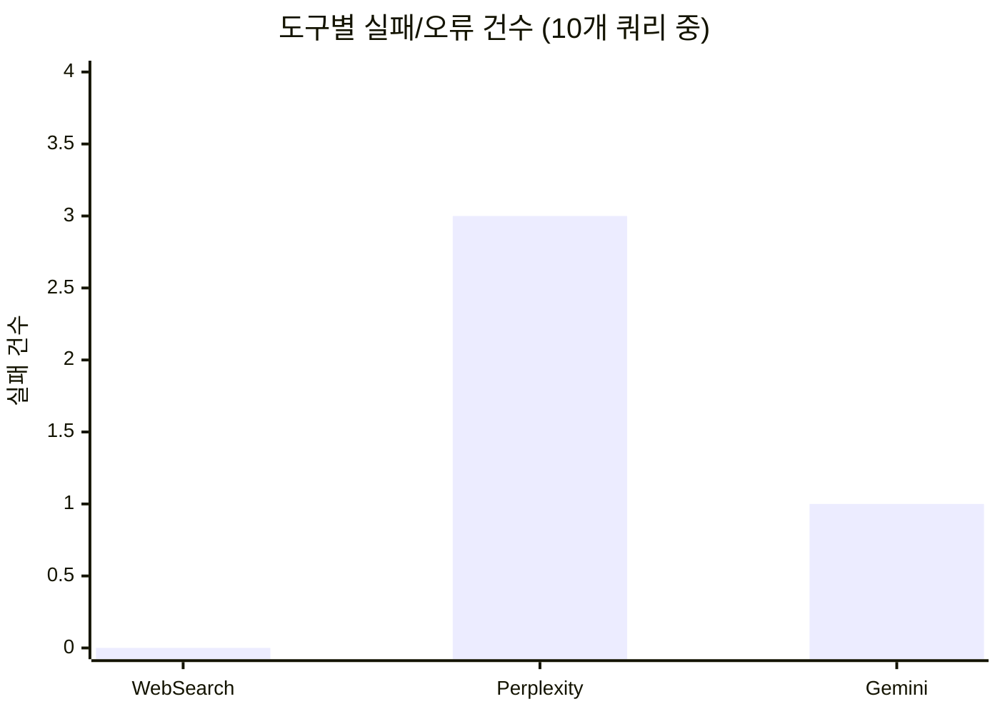

# 웹 검색 MCP 도구 비교: Perplexity vs Gemini Google Search vs WebSearch

## 들어가며

Claude Code에서 웹 검색이 필요할 때, 어떤 도구를 써야 할까요? 내장 WebSearch 하나로 충분할까요?

이 글에서는 Claude Code에서 사용할 수 있는 3가지 웹 검색 도구를 실제 테스트하고, 속도·품질·용도별 최적 선택 가이드를 제시합니다.

> **테스트 기준일**: 2026년 3월 (모델 버전: Perplexity `sonar`, Gemini `gemini-2.5-flash-lite`)
> 모델 업데이트에 따라 결과가 달라질 수 있습니다.

## MCP란?

**MCP(Model Context Protocol)**는 AI 모델이 외부 도구와 데이터 소스에 연결할 수 있게 해주는 표준 프로토콜입니다. Claude Code에서 MCP 서버를 등록하면, AI가 직접 외부 API를 호출하여 실시간 정보를 가져올 수 있습니다.

```json
// ~/.claude.json 에 MCP 서버 등록 예시
{
  "mcpServers": {
    "perplexity": {
      "command": "npx",
      "args": ["-y", "perplexity-mcp"],
      "env": {
        "PERPLEXITY_API_KEY": "your-api-key"
      }
    }
  }
}
```

이번에 비교한 3가지 도구도 모두 이 MCP 구조 위에서 동작합니다.

## 비교 대상

| 도구 | 유형 | 사용 모델 | 비용 |
|---|---|---|---|
| **WebSearch** | Claude Code 내장 | Anthropic 자체 검색 엔진 | Claude Code 구독에 포함 (Pro $20/월, Max $100~200/월) |
| **Perplexity MCP** | MCP 서버 ([perplexity-mcp](https://www.npmjs.com/package/perplexity-mcp), 공식) | `sonar` (기본값, `PERPLEXITY_MODEL`로 변경 가능) | $5/1K 요청 (sonar 기준, [가격표](https://docs.perplexity.ai/guides/pricing)) |
| **Gemini Google Search** | MCP 서버 ([mcp-gemini-google-search](https://www.npmjs.com/package/mcp-gemini-google-search), 커뮤니티) | `gemini-2.5-flash-lite` + Google Search Grounding | 무료 티어 있음, 유료 시 $0.01~0.02/1K 토큰 ([가격표](https://ai.google.dev/pricing)) |

## 테스트 설계

총 7개 쿼리로 3가지 카테고리를 테스트했습니다. 각 도구에 동일한 쿼리를 동일 시점에 실행하고, 단독 실행과 병렬 실행 각 1회씩 측정했습니다.

### 평가 기준 (루브릭)

별점은 다음 기준으로 매겼습니다:

| 등급 | 기준 |
|---|---|
| ★★★★★ | 질의 의도를 완전히 충족하고, 구체적 수치/예시/출처까지 포함 |
| ★★★★ | 핵심 정보를 정확히 제공하나, 일부 세부사항 누락 |
| ★★★ | 개괄적 답변은 제공하나, 깊이가 부족하거나 일부 부정확 |
| ★★ | 관련 정보를 일부만 제공하거나, 피상적 수준 |
| ★ | 거의 유용한 정보 없음 또는 명백한 오류 |

### 테스트 1: 시사 뉴스 검색 (한국어)

**질의**: "어제 당정 검찰개혁 협의안 결과와 야당 반응 및 향후 일정"

시의성이 중요한 한국 정치 뉴스로, **한국어 최신 정보 반영 능력**을 테스트합니다.

### 테스트 2: 기술 제품 정보 (영어)

**질의**: "ChatGPT 5.4-mini"

최신 출시된 AI 모델의 스펙·가격·기능 정보로, 기술 정확도를 테스트합니다.

### 테스트 3: 개발자 커뮤니티 토픽 5개 (영어)

r/programming 최근 포스트 5개를 선정하여 각각 검색:
1. Torturing Rustc by Emulating HKTs
2. Finding a CPU Design Bug in the Xbox 360
3. Java 26 is here
4. What is Infrastructure from Code?
5. The Paxos algorithm, when presented in plain English, is very simple

## 테스트 결과

### 응답 속도

개별 도구 실행 시간을 측정한 결과:

| 도구 | 단독 측정 | 5개 주제 평균 (추정) |
|---|---|---|
| **WebSearch** | 48.5s | ~9s |
| **Perplexity** | 25.2s | ~19s |
| **Gemini Google Search** | 30.2s | ~16s |

> **측정 방법**: 단독 측정은 Claude Code 서브에이전트(Agent 도구) 1회 실행의 전체 시간 (API 호출 + 모델 응답 생성 포함). 5개 주제 평균은 동일 5개 쿼리를 병렬 실행한 세션에서 각 도구가 응답을 반환한 시간의 평균 추정치입니다. 각 조건당 1회 실행이므로 통계적 유의성은 제한적입니다.

단독 실행 시 Perplexity가 가장 빨랐지만, 병렬 환경에서는 WebSearch가 가장 먼저 응답을 반환하는 경향을 보였습니다.

### 테스트 1 결과: 시사 뉴스

| 항목 | WebSearch | Perplexity | Gemini |
|---|---|---|---|
| 협의안 상세도 | ★★★★ 구체적 조항 | ★★★★★ 가장 정리된 요약 | ★★★ 개괄적 서술 |
| 야당 반응 | ★★ 피상적 | ★★ 미확인 고지 | ★★★★★ 필리버스터, 국조특위 |
| 향후 일정 | ★★★ 본회의만 | ★★★★ 형소법 후속 논의 | ★★★★ 국조 협상 전망 |
| 출처 수 | 10개 | 7개 | 10개 |

**뉴스 검색 승자: Gemini** — 야당 반응, 시민단체 동향까지 가장 폭넓게 커버

**한국어 검색 특이사항**: Gemini는 Google Search Grounding 덕분에 한국 뉴스 소스(연합뉴스, 한겨레 등)를 직접 인덱싱하여 한국어 쿼리에서 가장 강력했습니다. Perplexity는 한국어 쿼리를 영어 소스 중심으로 처리하는 경향이 있어, 한국 시사 뉴스에서는 상대적으로 약했습니다. WebSearch는 한국어 소스를 적절히 반환했으나 맥락 요약이 얕았습니다.

### 테스트 2 결과: 기술 제품 정보

| 항목 | WebSearch | Perplexity | Gemini |
|---|---|---|---|
| 스펙 정확도 | ★★★★ | ★★★★★ API 스펙 최상세 | ★★★ |
| 가격 정보 | ★★★★ 기본 가격 | ★★★★★ cached/regional까지 | ★ 없음 |
| 기술 상세도 | ★★★★ | ★★★★★ cutoff, rate limit 등 | ★★★ |
| 활용 시나리오 | ★★★ | ★★★ | ★★★★ use case 구체적 |

**기술 스펙 승자: Perplexity** — context window, max output, rate limit, cached 가격까지 한 번에 제공

### 테스트 3 결과: 개발자 토픽 5개 종합

| 항목 | WebSearch | Perplexity | Gemini |
|---|---|---|---|
| 정보 정확도 | ★★★★ | ★★★★★ | ★★★★ |
| 기술 상세도 | ★★★ | ★★★★★ | ★★★★ |
| 출처 다양성 | ★★★★ | ★★★★ | ★★★★★ |
| 원문 링크 발굴 | ★★★★★ | ★★★ | ★★★★ |
| 구조화 (표/코드) | ★★ | ★★★★★ | ★★★ |

주제별 차별화 포인트:

| 주제 | WebSearch 강점 | Perplexity 강점 | Gemini 강점 |
|---|---|---|---|
| Rust HKTs | 원문 블로그+HN 링크 | 코드 예시 (Functor::fmap) | rusty-hkt crate 등 라이브러리 |
| Xbox 360 CPU | Bruce Dawson 원문 링크 | MESI 프로토콜 위반 메커니즘 | 디버깅 어려움 관점 |
| Java 26 | 출시일+JEP 목록 | JEP 전체 표 + AOT 42% 수치 | JVP 생태계 (타 도구 미수록) |
| IfC | 구현체 6개 나열 | IaC vs IfC 5기준 비교표 | IaC 성숙도 비교 관점 |
| Paxos | 원문 블로그 링크 | 2f+1 공식 + Phase 단계별 | Raft 비교 + 홀수노드 이유 |

## 확장 테스트: 10개 쿼리 통계

초기 테스트(7개 쿼리)의 표본 한계를 보완하기 위해, 추가로 10개 쿼리를 설계하여 3개 도구에 동일 조건으로 실행했습니다.

### 확장 테스트 쿼리 목록

| # | 쿼리 | 카테고리 | 언어 |
|---|---|---|---|
| Q1 | 2026년 3월 한국 부동산 정책 변화 | 시사 | 한국어 |
| Q2 | 네이버 하이퍼클로바X 최신 업데이트 | 기술 | 한국어 |
| Q3 | Claude 4 Opus vs GPT-5 benchmark comparison | 기술 비교 | 영어 |
| Q4 | Rust 2024 edition new features | 프로그래밍 | 영어 |
| Q5 | SpaceX Starship latest launch 2026 | 뉴스 | 영어 |
| Q6 | FastAPI 0.115 변경사항 | 개발 | 한국어 |
| Q7 | 한국 달 탐사선 다누리 최신 성과 2025 | 과학 | 한국어 |
| Q8 | Deno 2.0 vs Bun performance benchmark | 기술 비교 | 영어 |
| Q9 | Quantum JavaScript framework v3.0 release date | **Hallucination 유도** | 영어 |
| Q10 | Log4Shell CVE-2021-44228 mitigation best practices 2025 | 보안 | 영어 |

### 10개 쿼리별 품질 점수


<details>
<summary>Mermaid 소스 코드</summary>

```mermaid
%% WebSearch (파랑 #4A90D9)
xychart-beta
    title "WebSearch 품질 점수 (평균 3.5)"
    x-axis ["Q1", "Q2", "Q3", "Q4", "Q5", "Q6", "Q7", "Q8", "Q9", "Q10"]
    y-axis "점수" 0 --> 5
    bar [3, 3, 3, 4, 4, 4, 3, 3, 4, 4]

%% Perplexity (주황 #E8854A)
xychart-beta
    title "Perplexity 품질 점수 (평균 3.7)"
    x-axis ["Q1", "Q2", "Q3", "Q4", "Q5", "Q6", "Q7", "Q8", "Q9", "Q10"]
    y-axis "점수" 0 --> 5
    bar [5, 4, 4, 3, 2, 1, 5, 5, 3, 5]

%% Gemini (초록 #5BB55B)
xychart-beta
    title "Gemini 품질 점수 (평균 4.2)"
    x-axis ["Q1", "Q2", "Q3", "Q4", "Q5", "Q6", "Q7", "Q8", "Q9", "Q10"]
    y-axis "점수" 0 --> 5
    bar [4, 5, 4, 5, 4, 5, 4, 4, 2, 5]
```

</details>

| # | 쿼리 | WebSearch | Perplexity | Gemini |
|---|---|---|---|---|
| Q1 | 한국 부동산 정책 | ★★★ | ★★★★★ | ★★★★ |
| Q2 | 하이퍼클로바X | ★★★ | ★★★★ | ★★★★★ |
| Q3 | Claude vs GPT-5 | ★★★ | ★★★★ | ★★★★ |
| Q4 | Rust 2024 | ★★★★ | ★★★ | ★★★★★ |
| Q5 | SpaceX Starship | ★★★★ | ★★ | ★★★★ |
| Q6 | FastAPI 0.115 | ★★★★ | ★ | ★★★★★ |
| Q7 | 다누리 탐사선 | ★★★ | ★★★★★ | ★★★★ |
| Q8 | Deno vs Bun | ★★★ | ★★★★★ | ★★★★ |
| Q9 | 가짜 프레임워크 | ★★★★ | ★★★ | ★★ |
| Q10 | Log4Shell 보안 | ★★★★ | ★★★★★ | ★★★★★ |
| | **평균** | **3.5** | **3.7** | **4.2** |

**핵심 발견**: WebSearch는 안정적이지만 평범(3~4점), Perplexity는 편차가 극단적(1점~5점), Gemini는 고르게 높은 점수(4~5점)를 기록했습니다.

### 카테고리별 평균 품질


<details>
<summary>Mermaid 소스 코드</summary>

```mermaid
%% WebSearch (파랑 #4A90D9)
xychart-beta
    title "WebSearch 카테고리별 평균"
    x-axis ["KR 시사", "KR 기술", "EN 기술", "EN 뉴스", "보안", "Anti-H"]
    y-axis "점수" 0 --> 5
    bar [3.0, 3.5, 3.3, 4.0, 4.0, 4.0]

%% Perplexity (주황 #E8854A)
xychart-beta
    title "Perplexity 카테고리별 평균"
    x-axis ["KR 시사", "KR 기술", "EN 기술", "EN 뉴스", "보안", "Anti-H"]
    y-axis "점수" 0 --> 5
    bar [5.0, 2.5, 4.0, 2.0, 5.0, 3.0]

%% Gemini (초록 #5BB55B)
xychart-beta
    title "Gemini 카테고리별 평균"
    x-axis ["KR 시사", "KR 기술", "EN 기술", "EN 뉴스", "보안", "Anti-H"]
    y-axis "점수" 0 --> 5
    bar [4.0, 5.0, 4.3, 4.0, 5.0, 2.0]
```

</details>

| 카테고리 | WebSearch | Perplexity | Gemini | 승자 |
|---|---|---|---|---|
| 한국어 시사/과학 (Q1, Q7) | 3.0 | **5.0** | 4.0 | Perplexity |
| 한국어 기술/개발 (Q2, Q6) | 3.5 | 2.5 | **5.0** | Gemini |
| 영어 기술 (Q3, Q4, Q8) | 3.3 | 4.0 | **4.3** | Gemini |
| 영어 뉴스 (Q5) | **4.0** | 2.0 | **4.0** | WebSearch = Gemini |
| 보안 (Q10) | 4.0 | **5.0** | **5.0** | Perplexity = Gemini |
| Hallucination 방어 (Q9) | **4.0** | 3.0 | 2.0 | WebSearch |

### 실패 및 오류 케이스 (확장)


<details>
<summary>Mermaid 소스 코드</summary>



</details>

**WebSearch — 실패 0건, 오류 0건**

가장 안정적. 10개 쿼리 모두 관련 정보를 반환했습니다. 다만 깊이가 얕고 저품질 SEO 사이트 결과가 혼입되는 경향이 있습니다 (Q3에서 신뢰도 낮은 마케팅 블로그 다수 포함).

**Perplexity — 실패 3건**

| 쿼리 | 실패 유형 | 상세 |
|---|---|---|
| Q5 SpaceX | 정보 누락 | Starship Flight 12 준비 정보를 전혀 반영하지 못하고 "2026년 스타십 발사 일정이 없다"고 오답 |
| Q6 FastAPI | 완전 실패 | "FastAPI 0.115 변경사항이 확인되지 않는다"고 답변. 공식 Release Notes 접근 실패. 한국어 쿼리 시 영문 공식 소스를 놓침 |
| Q2 하이퍼클로바X | API 오류 | 1차 시도에서 `MCP error -32603` 발생 (쿼리에 "2026" 포함 시). 재시도 후 성공 |

추가 주의사항:
- Q4 Rust 2024에서 **사실 오류**: `array IntoIterator`(Rust 1.53에서 도입)와 `or-patterns`를 2024 Edition 신기능으로 잘못 소개
- Q2에서 "엑사원 3.0 독자 모델 결합" 표현이 LG AI 연구원의 엑사원과 혼동 가능

**Gemini — 실패 1건**

| 쿼리 | 실패 유형 | 상세 |
|---|---|---|
| Q9 가짜 프레임워크 | **부분 Hallucination** | "Quantum.js released a new version on December 15, 2025"라는 검증 불가 날짜를 `iot-sdn.space`라는 불명확한 출처에서 인용. 존재하지 않는 프레임워크에 대해 실존하는 것처럼 정보 생성 |

추가 주의사항:
- Q3에서 "Claude Opus 4.6" 등 미확정 모델명 언급 (hallucination 경계)
- 출처 URL이 일관되게 `vertexaisearch.cloud.google.com` 리다이렉트 형태로, 원본 URL 직접 확인이 어려움

> **종합**: WebSearch는 "못하지만 틀리지 않는" 안전한 도구, Perplexity는 "잘하거나 실패하거나" 극단적, Gemini는 "대체로 잘하지만 가끔 만들어낸다"는 패턴을 보였습니다.

## 최종 비교 요약

| 항목 | WebSearch | Perplexity | Gemini |
|---|---|---|---|
| 응답 속도 | ★★★★★ | ★★★ | ★★★★ |
| 기술 상세도 | ★★★ | ★★★★★ | ★★★★ |
| 뉴스/시사 | ★★★★ | ★★★ | ★★★★★ |
| 출처 다양성 | ★★★★ | ★★★★ | ★★★★★ |
| 원문 URL 발굴 | ★★★★★ | ★★★ | ★★★★ |
| 구조화 품질 | ★★ | ★★★★★ | ★★★ |
| 안정성 (실패율) | ★★★★★ 0/10 | ★★ 3/10 | ★★★★ 1/10 |
| Hallucination 방어 | ★★★★★ | ★★★★ | ★★★ |
| 한국어 쿼리 | ★★★ | ★★★ | ★★★★★ |
| 추가 비용 | 없음 | API 과금 | API 과금 |
| **10개 쿼리 평균** | **3.5/5** | **3.7/5** | **4.2/5** |

## 도구 선택 가이드

각 도구는 명확한 강점 영역이 있습니다. 용도에 따라 최적의 도구를 선택하세요.

```
┌─────────────────────────────────┐
│     어떤 검색이 필요한가?         │
└──────────┬──────────────────────┘
           │
     ┌─────┴─────┐
     ▼           ▼
 기술 심층 조사   최신 뉴스/폭넓은 수집   원문 URL/빠른 개요
     │               │                      │
     ▼               ▼                      ▼
 Perplexity    Gemini Google Search      WebSearch
     │               │
     │ (실패 시)      │ (실패 시)
     ▼               ▼
 Gemini         WebSearch
     │
     │ (실패 시)
     ▼
 WebSearch
```

| 상황 | 1순위 | fallback |
|---|---|---|
| 기술 개념 심층 조사 (스펙, 코드, 비교 분석) | Perplexity | Gemini → WebSearch |
| 최신 뉴스, 공식 발표, 다각도 정보 수집 | Gemini | WebSearch |
| 원문 URL 탐색, 빠른 개요 | WebSearch | — |
| 어떤 도구든 실패 시 최종 fallback | WebSearch | — |

## Claude Code에서 설정하기

### 1. Perplexity MCP 추가

[Perplexity API 키 발급](https://docs.perplexity.ai/) → Settings > API Keys에서 생성

```bash
claude mcp add perplexity \
  --env PERPLEXITY_API_KEY="your-key" \
  -- npx -y perplexity-mcp
```

제공 도구: `perplexity_search`, `perplexity_ask`, `perplexity_research`, `perplexity_reason`

### 2. Gemini Google Search MCP 추가

[Google AI Studio API 키 발급](https://aistudio.google.com/apikey) → "Create API key"로 생성

```bash
claude mcp add gemini-google-search \
  --env GEMINI_API_KEY="your-key" \
  -- npx -y mcp-gemini-google-search
```

> 이 패키지(`mcp-gemini-google-search`)는 커뮤니티 개발 패키지입니다. Google 공식 MCP 서버가 아닌 점 참고하세요.

### 3. CLAUDE.md에 선택 원칙 반영

```markdown
### 웹 검색 도구 선택 원칙
- **기술 심층 조사** → perplexity → gemini-google-search → WebSearch
- **최신 뉴스/폭넓은 수집** → gemini-google-search → WebSearch
- **원문 URL/빠른 개요** → WebSearch 내장
- **최종 fallback** → WebSearch 내장
```

CLAUDE.md에 이 원칙을 명시하면, Claude Code가 자동으로 용도에 맞는 도구를 선택합니다.

## 한계 (Limitations)

이 비교는 다음 제약 하에서 이루어졌습니다:

- **표본 크기**: 초기 7개 + 확장 10개 = 총 17개 쿼리입니다. 경향은 파악할 수 있으나, 통계적 일반화에는 한계가 있습니다
- **단일 실행**: 각 쿼리당 1회 실행입니다. 네트워크 상태, API 서버 부하 등에 따라 결과가 달라질 수 있습니다
- **속도 측정 한계**: 확장 테스트에서 에이전트 내부 셸 호출 구조로 인해 정밀한 응답 시간 측정이 어려웠습니다. 속도 데이터는 초기 테스트(단독 실행) 기준을 참고하세요
- **한국어 테스트**: 확장 테스트에서 한국어 쿼리를 4개(Q1, Q2, Q6, Q7)로 늘렸으나, 여전히 영어 쿼리 대비 소수입니다
- **모델 버전 의존**: Perplexity `sonar`, Gemini `gemini-2.5-flash-lite`는 지속적으로 업데이트됩니다. 이 글의 결과는 2026년 3월 기준이며, 향후 모델 개선으로 순위가 바뀔 수 있습니다
- **평가 주관성**: 별점은 필자의 판단에 기반합니다. 위 루브릭을 참고하되, 독자의 용도에 따라 평가가 다를 수 있습니다

## 마치며

17개 쿼리 테스트를 통해 확인된 각 도구의 성격을 한 줄로 요약하면:

- **WebSearch** (평균 3.5/5): "못하지만 틀리지 않는다." 실패율 0%, 가장 안정적. 추가 비용 없이 빠르게 원문 링크를 찾아주는 만능 fallback입니다.
- **Perplexity** (평균 3.7/5): "잘하거나 실패하거나." 잘 되면 코드 예시·표·수치까지 포함한 압도적 깊이를 보여주지만, 한국어 개발 쿼리나 최신 뉴스에서 완전 실패하는 경우가 있습니다 (실패율 30%).
- **Gemini Google Search** (평균 4.2/5): "고르게 잘하지만 가끔 만들어낸다." Google Search Grounding 기반으로 출처 다양성과 한국어 검색이 가장 강력하지만, 존재하지 않는 정보에 대해 hallucination 위험이 있습니다.

결국 하나의 최강 도구는 없습니다. MCP의 진짜 가치는 **용도에 맞는 도구를 자유롭게 조합하고, 서로의 약점을 fallback으로 보완할 수 있다**는 점에 있습니다. CLAUDE.md에 선택 원칙을 명시해두면, AI가 알아서 최적의 도구를 골라 씁니다.
