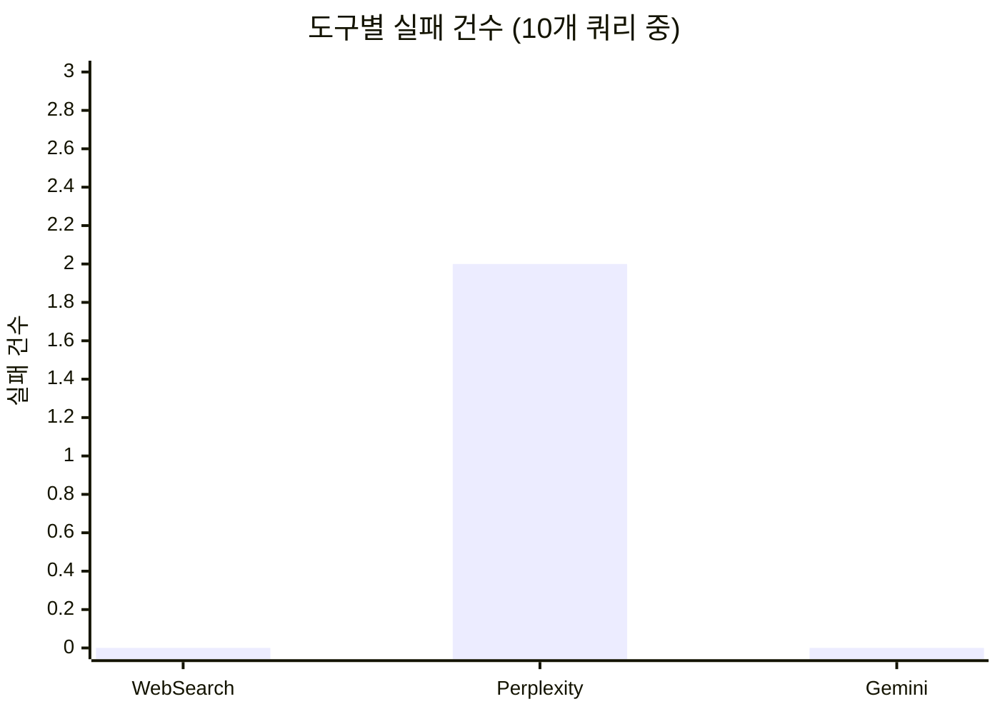

# 웹 검색 MCP 도구 비교: Perplexity vs Gemini Google Search vs WebSearch

## 들어가며

Claude Code에서 웹 검색이 필요할 때, 어떤 도구를 써야 할까요? 내장 WebSearch 하나로 충분할까요?

이 글에서는 Claude Code에서 사용할 수 있는 3가지 웹 검색 도구를 실제 테스트하고, 속도·품질·용도별 최적 선택 가이드를 제시합니다.

> **테스트 기준일**: 2026년 3월 (모델 버전: Perplexity `sonar`, Gemini `gemini-2.5-flash-lite`)
> 모델 업데이트에 따라 결과가 달라질 수 있습니다.

## MCP란?

**MCP(Model Context Protocol)**는 AI 모델이 외부 도구와 데이터 소스에 연결할 수 있게 해주는 표준 프로토콜입니다. Claude Code에서 MCP 서버를 등록하면, AI가 직접 외부 API를 호출하여 실시간 정보를 가져올 수 있습니다.

```json
// ~/.claude.json 에 MCP 서버 등록 예시
{
  "mcpServers": {
    "perplexity": {
      "command": "npx",
      "args": ["-y", "perplexity-mcp"],
      "env": {
        "PERPLEXITY_API_KEY": "your-api-key"
      }
    }
  }
}
```

이번에 비교한 3가지 도구도 모두 이 MCP 구조 위에서 동작합니다.

## 비교 대상

| 도구 | 유형 | 사용 모델 | 비용 |
|---|---|---|---|
| **WebSearch** | Claude Code 내장 | Anthropic 자체 검색 엔진 | Claude Code 구독에 포함 (Pro $20/월, Max $100~200/월) |
| **Perplexity MCP** | MCP 서버 ([perplexity-mcp](https://www.npmjs.com/package/perplexity-mcp), 공식) | `sonar` (기본값, `PERPLEXITY_MODEL`로 변경 가능) | $5/1K 요청 (sonar 기준, [가격표](https://docs.perplexity.ai/guides/pricing)) |
| **Gemini Google Search** | MCP 서버 ([mcp-gemini-google-search](https://www.npmjs.com/package/mcp-gemini-google-search), 커뮤니티) | `gemini-2.5-flash-lite` + Google Search Grounding | 무료 티어 있음, 유료 시 $0.01~0.02/1K 토큰 ([가격표](https://ai.google.dev/pricing)) |

## 테스트 설계

6가지 카테고리(한국어 시사, 한국어 기술, 영어 기술, 영어 뉴스, 보안, hallucination 방어)를 커버하는 10개 쿼리를 설계하고, 3개 도구에 동일 시점에 실행했습니다.

### 평가 기준 (루브릭)

| 점수 | 기준 |
|---|---|
| 5 | 질의 의도를 완전히 충족. 구체적 수치, 출처, 예시까지 포함 |
| 4 | 핵심 정보를 정확히 제공하나, 일부 세부사항 누락 |
| 3 | 개괄적 답변은 제공하나, 깊이 부족하거나 일부 부정확 |
| 2 | 관련 정보를 일부만 제공하거나, 피상적 수준 |
| 1 | 거의 유용한 정보 없음 또는 명백한 오류 |

### 테스트 쿼리 목록

| # | 쿼리 | 카테고리 | 언어 |
|---|---|---|---|
| Q1 | 2026년 3월 한국 부동산 정책 변화 | 시사 | 한국어 |
| Q2 | 네이버 하이퍼클로바X 최신 업데이트 | 기술 | 한국어 |
| Q3 | Claude 4 Opus vs GPT-5 benchmark comparison | 기술 비교 | 영어 |
| Q4 | Rust 2024 edition new features | 프로그래밍 | 영어 |
| Q5 | SpaceX Starship latest launch 2026 | 뉴스 | 영어 |
| Q6 | FastAPI 0.115 변경사항 | 개발 | 한국어 |
| Q7 | 한국 달 탐사선 다누리 최신 성과 2025 | 과학 | 한국어 |
| Q8 | Deno 2.0 vs Bun performance benchmark | 기술 비교 | 영어 |
| Q9 | Quantum JavaScript framework v3.0 release date | **Hallucination 유도** | 영어 |
| Q10 | Log4Shell CVE-2021-44228 mitigation best practices 2025 | 보안 | 영어 |

## 테스트 결과

### 쿼리별 품질 점수


<details>
<summary>Mermaid 소스 코드</summary>

```mermaid
%% WebSearch (파랑 #4A90D9)
xychart-beta
    title "WebSearch 품질 점수 (평균 3.4)"
    x-axis ["Q1", "Q2", "Q3", "Q4", "Q5", "Q6", "Q7", "Q8", "Q9", "Q10"]
    y-axis "점수" 0 --> 5
    bar [4, 3, 3, 3, 4, 4, 4, 3, 3, 3]

%% Perplexity (주황 #E8854A)
xychart-beta
    title "Perplexity 품질 점수 (평균 4.0)"
    x-axis ["Q1", "Q2", "Q3", "Q4", "Q5", "Q6", "Q7", "Q8", "Q9", "Q10"]
    y-axis "점수" 0 --> 5
    bar [5, 5, 4, 5, 2, 1, 5, 5, 4, 4]

%% Gemini (초록 #5BB55B)
xychart-beta
    title "Gemini 품질 점수 (평균 4.3)"
    x-axis ["Q1", "Q2", "Q3", "Q4", "Q5", "Q6", "Q7", "Q8", "Q9", "Q10"]
    y-axis "점수" 0 --> 5
    bar [4, 4, 4, 5, 5, 5, 4, 4, 3, 5]
```

</details>

| # | 쿼리 | WebSearch | Perplexity | Gemini | 비고 |
|---|---|---|---|---|---|
| Q1 | 한국 부동산 정책 | 4 | **5** | 4 | PX: 3월은 "준비 국면"임을 정확히 구분 |
| Q2 | 하이퍼클로바X | 3 | **5** | 4 | PX: 수치(MMLU 79.6%, 비용 50%↓) 포함. GM: 당일 AMD 뉴스 반영 |
| Q3 | Claude vs GPT-5 | 3 | 4 | 4 | WS: 저품질 SEO 사이트 혼입 |
| Q4 | Rust 2024 | 3 | **5** | **5** | WS: RPIT, match ergonomics 등 주요 변경사항 누락 |
| Q5 | SpaceX Starship | 4 | **2** ✗ | **5** | PX: "발사 일정 없다"고 오답. GM: Flight 12 상세 스펙 제공 |
| Q6 | FastAPI 0.115 | 4 | **1** ✗ | **5** | PX: 완전 실패 (한국어 소스 편향). GM: 공식 Release Notes 완전 커버 |
| Q7 | 다누리 탐사선 | 4 | **5** | 4 | PX: 탑재체별 성과, 논문 30편 등 최상세 |
| Q8 | Deno vs Bun | 3 | **5** | 4 | PX: 14회 테스트 승패, 브레이킹 포인트 수치 |
| Q9 | 가짜 프레임워크 | 3 | **4** | 3 | PX: "존재하지 않음"을 명시 선언. WS/GM: 소극적 표현 |
| Q10 | Log4Shell 보안 | 3 | 4 | **5** | GM: Java 버전별 세분화, SBOM, 컨테이너 보안까지 |
| | **평균** | **3.4** | **4.0** | **4.3** | |

### 카테고리별 평균 품질


<details>
<summary>Mermaid 소스 코드</summary>

```mermaid
%% WebSearch (파랑 #4A90D9)
xychart-beta
    title "WebSearch 카테고리별 평균"
    x-axis ["KR 시사", "KR 기술", "EN 기술", "EN 뉴스", "보안", "Anti-H"]
    y-axis "점수" 0 --> 5
    bar [4.0, 3.5, 3.0, 4.0, 3.0, 3.0]

%% Perplexity (주황 #E8854A)
xychart-beta
    title "Perplexity 카테고리별 평균"
    x-axis ["KR 시사", "KR 기술", "EN 기술", "EN 뉴스", "보안", "Anti-H"]
    y-axis "점수" 0 --> 5
    bar [5.0, 3.0, 4.7, 2.0, 4.0, 4.0]

%% Gemini (초록 #5BB55B)
xychart-beta
    title "Gemini 카테고리별 평균"
    x-axis ["KR 시사", "KR 기술", "EN 기술", "EN 뉴스", "보안", "Anti-H"]
    y-axis "점수" 0 --> 5
    bar [4.0, 4.5, 4.3, 5.0, 5.0, 3.0]
```

</details>

| 카테고리 | WebSearch | Perplexity | Gemini | 승자 |
|---|---|---|---|---|
| 한국어 시사/과학 (Q1, Q7) | 4.0 | **5.0** | 4.0 | **Perplexity** |
| 한국어 기술/개발 (Q2, Q6) | 3.5 | 3.0 | **4.5** | **Gemini** |
| 영어 기술 (Q3, Q4, Q8) | 3.0 | **4.7** | 4.3 | **Perplexity** |
| 영어 뉴스 (Q5) | 4.0 | 2.0 | **5.0** | **Gemini** |
| 보안 (Q10) | 3.0 | 4.0 | **5.0** | **Gemini** |
| Hallucination 방어 (Q9) | 3.0 | **4.0** | 3.0 | **Perplexity** |

### 실패 및 오류 케이스


<details>
<summary>Mermaid 소스 코드</summary>



</details>

**WebSearch — 실패 0건**

10개 쿼리 모두 관련 정보를 반환. 가장 안정적이지만 깊이가 일관되게 얕고(평균 3.4), 저품질 SEO 사이트 결과 혼입 경향이 있습니다.

**Perplexity — 실패 2건**

| 쿼리 | 실패 유형 | 상세 |
|---|---|---|
| Q5 SpaceX | 정보 오판 | Starship Flight 12가 임박했음에도 "2026년 스타십 발사 일정이 없다"고 단정. Falcon 9 일정만 나열 |
| Q6 FastAPI | 완전 실패 | "변경사항을 확인할 수 없다"며 무관한 ComfyUI 정보 제공. 한국어 쿼리 시 공식 영문 Release Notes 접근 실패 |

**Perplexity의 패턴**: 잘할 때는 5점(Q1, Q2, Q4, Q7, Q8)으로 압도적이지만, 실패할 때는 1~2점으로 완전히 무너집니다. 특히 **한국어로 된 개발 쿼리**(Q6)와 **최신 뉴스**(Q5)에서 반복적으로 취약합니다.

**Gemini — 실패 0건**

10개 쿼리 모두 Pass. 다만 주의할 점:
- 출처 URL이 `vertexaisearch.cloud.google.com` 리다이렉트 형태로, 원본 URL 직접 확인이 어려움
- Q8에서 Deno 처리량을 12,400 rps로 기술하여 다른 소스(22,000~29,000 rps)와 불일치

## 최종 비교 요약

| 항목 | WebSearch | Perplexity | Gemini |
|---|---|---|---|
| **10개 쿼리 평균** | **3.4/5** | **4.0/5** | **4.3/5** |
| 안정성 (실패율) | ★★★★★ 0/10 | ★★★ 2/10 | ★★★★★ 0/10 |
| 기술 심층 조사 | ★★★ | ★★★★★ | ★★★★ |
| 한국어 시사/과학 | ★★★★ | ★★★★★ | ★★★★ |
| 한국어 기술/개발 | ★★★ | ★★★ | ★★★★★ |
| 영어 뉴스/최신 정보 | ★★★★ | ★★ | ★★★★★ |
| 보안/전문 분야 | ★★★ | ★★★★ | ★★★★★ |
| 출처 투명성 | ★★★★★ 직접 URL | ★★★★ 인라인 인용 | ★★★ redirect URL |
| Hallucination 방어 | ★★★ | ★★★★ | ★★★ |
| 추가 비용 | 없음 | API 과금 | API 과금 |

## 도구 선택 가이드

테스트 결과를 바탕으로 한 **용도별 최적 선택**:

```
┌────────────────────────────────────┐
│       어떤 검색이 필요한가?           │
└──────────┬─────────────────────────┘
           │
     ┌─────┼──────────┐
     ▼     ▼          ▼
 기술 심층  뉴스/한국어  빠른 개요
     │     기술/보안       │
     ▼     ▼              ▼
 Perplexity  Gemini    WebSearch
     │     │
     │     │ (실패 시)
     ▼     ▼
 Gemini  WebSearch
     │
     │ (실패 시)
     ▼
 WebSearch
```

| 상황 | 1순위 | fallback | 근거 |
|---|---|---|---|
| 기술 개념 심층 조사 (스펙, 코드, 비교) | Perplexity | Gemini → WebSearch | 영어 기술 평균 4.7로 최고 |
| 한국어 시사, 과학 뉴스 | Perplexity | Gemini → WebSearch | 한국어 시사 평균 5.0 |
| 최신 뉴스, 한국어 기술/개발 | **Gemini** | WebSearch | 뉴스 5.0, 한국어 기술 4.5. Perplexity는 이 영역에서 실패 이력 |
| 보안, 전문 분야 심층 분석 | **Gemini** | Perplexity → WebSearch | 보안 5.0, 공식 기관 소스 활용 우수 |
| 원문 URL 탐색, 빠른 개요 | WebSearch | — | 추가 비용 없음, 실패율 0% |
| 최종 fallback | WebSearch | — | 어떤 상황에서든 3~4점 보장 |

> **이전 가이드와의 차이**: Gemini의 역할이 확대되었습니다. 기존에는 "뉴스/시사 전문"으로만 추천했으나, 테스트 결과 한국어 기술 문서, 보안, 최신 뉴스 등 **Perplexity가 실패하는 영역 전반에서 Gemini가 안정적으로 높은 점수**를 기록했습니다. Perplexity는 "잘하면 최고"이지만 실패 위험이 있으므로, **확실한 영역(영어 기술 심층, 한국어 시사)에만 1순위로 사용**하고 나머지는 Gemini를 우선하는 것이 안전합니다.

## Claude Code에서 설정하기

### 1. Perplexity MCP 추가

[Perplexity API 키 발급](https://docs.perplexity.ai/) → Settings > API Keys에서 생성

```bash
claude mcp add perplexity \
  --env PERPLEXITY_API_KEY="your-key" \
  -- npx -y perplexity-mcp
```

제공 도구: `perplexity_search`, `perplexity_ask`, `perplexity_research`, `perplexity_reason`

### 2. Gemini Google Search MCP 추가

[Google AI Studio API 키 발급](https://aistudio.google.com/apikey) → "Create API key"로 생성

```bash
claude mcp add gemini-google-search \
  --env GEMINI_API_KEY="your-key" \
  -- npx -y mcp-gemini-google-search
```

> 이 패키지(`mcp-gemini-google-search`)는 커뮤니티 개발 패키지입니다. Google 공식 MCP 서버가 아닌 점 참고하세요.

### 3. CLAUDE.md에 선택 원칙 반영

```markdown
### 웹 검색 도구 선택 원칙
- **기술 심층 조사 (영어)** → perplexity → gemini-google-search → WebSearch
- **한국어 시사/과학** → perplexity → gemini-google-search → WebSearch
- **최신 뉴스/한국어 기술/보안** → gemini-google-search → WebSearch
- **원문 URL/빠른 개요** → WebSearch 내장
- **최종 fallback** → WebSearch 내장
```

CLAUDE.md에 이 원칙을 명시하면, Claude Code가 자동으로 용도에 맞는 도구를 선택합니다.

## 한계 (Limitations)

- **표본 크기**: 10개 쿼리(한국어 4개, 영어 6개)로 경향 파악은 가능하나 통계적 일반화에는 한계
- **단일 실행**: 각 쿼리당 1회 실행. 네트워크 상태, API 서버 부하에 따라 결과가 달라질 수 있음
- **모델 버전 의존**: Perplexity `sonar`, Gemini `gemini-2.5-flash-lite`는 지속 업데이트됨. 2026년 3월 기준
- **평가 주관성**: 점수는 위 루브릭에 따르되, 독자의 용도에 따라 평가가 다를 수 있음

## 마치며

10개 쿼리 테스트를 통해 확인된 각 도구의 성격:

- **Gemini** (평균 4.3/5, 실패 0건): "고르게 잘한다." 실패율 0%에 평균 점수도 최고. 한국어 기술 문서, 뉴스, 보안 등 폭넓은 영역에서 안정적. 출처 URL이 리다이렉트인 점만 아쉽습니다.
- **Perplexity** (평균 4.0/5, 실패 2건): "잘하면 최고, 실패하면 바닥." 5점을 6번 기록하며 깊이는 압도적이지만, 최신 뉴스와 한국어 개발 쿼리에서 완전 실패하는 리스크가 있습니다.
- **WebSearch** (평균 3.4/5, 실패 0건): "틀리지 않는 만능 fallback." 추가 비용 없이 어디서든 3~4점을 보장하지만, 깊이 있는 조사에는 부족합니다.

결국 하나의 최강 도구는 없습니다. MCP의 진짜 가치는 **용도에 맞는 도구를 자유롭게 조합하고, 서로의 약점을 fallback으로 보완할 수 있다**는 점에 있습니다. CLAUDE.md에 선택 원칙을 명시해두면, AI가 알아서 최적의 도구를 골라 씁니다.
