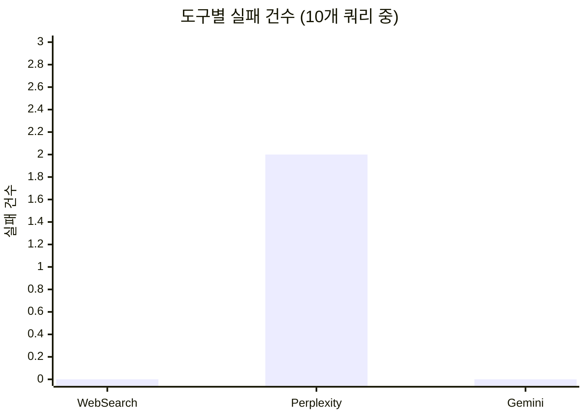
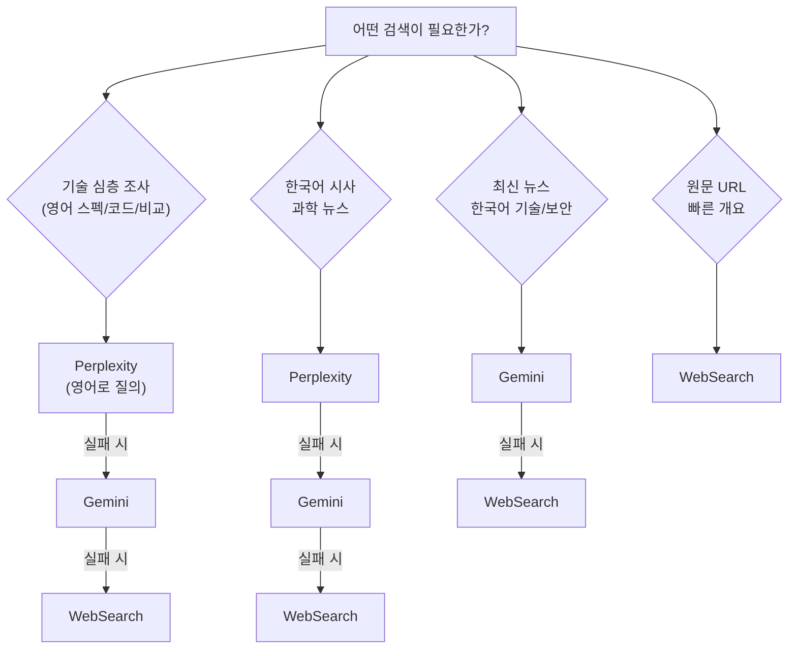

# 웹 검색 MCP 도구 비교: Perplexity vs Gemini Google Search vs WebSearch

## 들어가며

Claude Code에서 웹 검색이 필요할 때, 어떤 도구를 써야 할까요? 내장 WebSearch 하나로 충분할까요?

이 글에서는 Claude Code에서 사용할 수 있는 3가지 웹 검색 도구를 10개 쿼리로 실제 테스트하고, 품질·안정성·용도별 최적 선택 가이드를 제시합니다.

> **테스트 기준일**: 2026년 3월 (모델 버전: Perplexity `sonar`, Gemini `gemini-2.5-flash-lite`)
> 모델 업데이트에 따라 결과가 달라질 수 있습니다.

## MCP란?

**MCP(Model Context Protocol)**는 AI 모델이 외부 도구와 데이터 소스에 연결할 수 있게 해주는 표준 프로토콜입니다. Claude Code에서 MCP 서버를 등록하면, AI가 직접 외부 API를 호출하여 실시간 정보를 가져올 수 있습니다.

```json
// ~/.claude.json 에 MCP 서버 등록 예시
{
  "mcpServers": {
    "perplexity": {
      "command": "npx",
      "args": ["-y", "perplexity-mcp"],
      "env": {
        "PERPLEXITY_API_KEY": "your-api-key"
      }
    }
  }
}
```

이번에 비교한 3가지 도구도 모두 이 MCP 구조 위에서 동작합니다.

## 비교 대상

| 도구 | 유형 | 사용 모델 | 비용 |
|---|---|---|---|
| **WebSearch** | Claude Code 내장 | Anthropic 자체 검색 엔진 | Claude Code 구독에 포함 (Pro $20/월, Max $100~200/월) |
| **Perplexity MCP** | MCP 서버 ([perplexity-mcp](https://www.npmjs.com/package/perplexity-mcp), 공식) | `sonar` (기본값, `PERPLEXITY_MODEL`로 변경 가능) | $5/1K 요청 (sonar 기준, [가격표](https://docs.perplexity.ai/guides/pricing)) |
| **Gemini Google Search** | MCP 서버 ([mcp-gemini-google-search](https://www.npmjs.com/package/mcp-gemini-google-search), 커뮤니티) | `gemini-2.5-flash-lite` + Google Search Grounding | 무료 티어 있음, 유료 시 $0.01~0.02/1K 토큰 ([가격표](https://ai.google.dev/pricing)) |

## 테스트 설계

6가지 카테고리(한국어 시사, 한국어 기술, 영어 기술, 영어 뉴스, 보안, hallucination 방어)를 커버하는 10개 쿼리를 설계하고, 3개 도구에 동일 시점에 실행했습니다.

### 평가 기준 (루브릭)

| 점수 | 기준 |
|---|---|
| 5 | 질의 의도를 완전히 충족. 구체적 수치, 출처, 예시까지 포함 |
| 4 | 핵심 정보를 정확히 제공하나, 일부 세부사항 누락 |
| 3 | 개괄적 답변은 제공하나, 깊이 부족하거나 일부 부정확 |
| 2 | 관련 정보를 일부만 제공하거나, 피상적 수준 |
| 1 | 거의 유용한 정보 없음 또는 명백한 오류 |

### 테스트 쿼리 목록

| # | 쿼리 | 카테고리 | 언어 |
|---|---|---|---|
| Q1 | 2026년 3월 한국 부동산 정책 변화 | 시사 | 한국어 |
| Q2 | 네이버 하이퍼클로바X 최신 업데이트 | 기술 | 한국어 |
| Q3 | Claude 4 Opus vs GPT-5 benchmark comparison | 기술 비교 | 영어 |
| Q4 | Rust 2024 edition new features | 프로그래밍 | 영어 |
| Q5 | SpaceX Starship latest launch 2026 | 뉴스 | 영어 |
| Q6 | FastAPI 0.115 변경사항 | 개발 | 한국어 |
| Q7 | 한국 달 탐사선 다누리 최신 성과 2025 | 과학 | 한국어 |
| Q8 | Deno 2.0 vs Bun performance benchmark | 기술 비교 | 영어 |
| Q9 | Quantum JavaScript framework v3.0 release date | **Hallucination 유도** | 영어 |
| Q10 | Log4Shell CVE-2021-44228 mitigation best practices 2025 | 보안 | 영어 |

## 테스트 결과

### 쿼리별 품질 점수


<details>
<summary>Mermaid 소스 코드</summary>

```mermaid
%% WebSearch (파랑 #4A90D9)
xychart-beta
    title "WebSearch 품질 점수 (평균 3.4)"
    x-axis ["Q1", "Q2", "Q3", "Q4", "Q5", "Q6", "Q7", "Q8", "Q9", "Q10"]
    y-axis "점수" 0 --> 5
    bar [4, 3, 3, 3, 4, 4, 4, 3, 3, 3]

%% Perplexity (주황 #E8854A)
xychart-beta
    title "Perplexity 품질 점수 (평균 4.0)"
    x-axis ["Q1", "Q2", "Q3", "Q4", "Q5", "Q6", "Q7", "Q8", "Q9", "Q10"]
    y-axis "점수" 0 --> 5
    bar [5, 5, 4, 5, 2, 1, 5, 5, 4, 4]

%% Gemini (초록 #5BB55B)
xychart-beta
    title "Gemini 품질 점수 (평균 4.3)"
    x-axis ["Q1", "Q2", "Q3", "Q4", "Q5", "Q6", "Q7", "Q8", "Q9", "Q10"]
    y-axis "점수" 0 --> 5
    bar [4, 4, 4, 5, 5, 5, 4, 4, 3, 5]
```

</details>

| # | 쿼리 | WebSearch | Perplexity | Gemini | 비고 |
|---|---|---|---|---|---|
| Q1 | 한국 부동산 정책 | 4 | **5** | 4 | PX: 3월은 "준비 국면"임을 정확히 구분 |
| Q2 | 하이퍼클로바X | 3 | **5** | 4 | PX: 수치(MMLU 79.6%, 비용 50%↓) 포함. GM: 당일 AMD 뉴스 반영 |
| Q3 | Claude vs GPT-5 | 3 | 4 | 4 | WS: 저품질 SEO 사이트 혼입 |
| Q4 | Rust 2024 | 3 | **5** | **5** | WS: RPIT, match ergonomics 등 주요 변경사항 누락 |
| Q5 | SpaceX Starship | 4 | **2** ✗ | **5** | PX: "발사 일정 없다"고 오답. GM: Flight 12 상세 스펙 제공 |
| Q6 | FastAPI 0.115 | 4 | **1** ✗ | **5** | PX: 완전 실패 (한국어 소스 편향). GM: 공식 Release Notes 완전 커버 |
| Q7 | 다누리 탐사선 | 4 | **5** | 4 | PX: 탑재체별 성과, 논문 30편 등 최상세 |
| Q8 | Deno vs Bun | 3 | **5** | 4 | PX: 14회 테스트 승패, 브레이킹 포인트 수치 |
| Q9 | 가짜 프레임워크 | 3 | **4** | 3 | PX: "존재하지 않음"을 명시 선언. WS/GM: 소극적 표현 |
| Q10 | Log4Shell 보안 | 3 | 4 | **5** | GM: Java 버전별 세분화, SBOM, 컨테이너 보안까지 |
| | **평균** | **3.4** | **4.0** | **4.3** | |

### 카테고리별 평균 품질


<details>
<summary>Mermaid 소스 코드</summary>

```mermaid
%% WebSearch (파랑 #4A90D9)
xychart-beta
    title "WebSearch 카테고리별 평균"
    x-axis ["KR 시사", "KR 기술", "EN 기술", "EN 뉴스", "보안", "Anti-H"]
    y-axis "점수" 0 --> 5
    bar [4.0, 3.5, 3.0, 4.0, 3.0, 3.0]

%% Perplexity (주황 #E8854A)
xychart-beta
    title "Perplexity 카테고리별 평균"
    x-axis ["KR 시사", "KR 기술", "EN 기술", "EN 뉴스", "보안", "Anti-H"]
    y-axis "점수" 0 --> 5
    bar [5.0, 3.0, 4.7, 2.0, 4.0, 4.0]

%% Gemini (초록 #5BB55B)
xychart-beta
    title "Gemini 카테고리별 평균"
    x-axis ["KR 시사", "KR 기술", "EN 기술", "EN 뉴스", "보안", "Anti-H"]
    y-axis "점수" 0 --> 5
    bar [4.0, 4.5, 4.3, 5.0, 5.0, 3.0]
```

</details>

| 카테고리 | WebSearch | Perplexity | Gemini | 승자 |
|---|---|---|---|---|
| 한국어 시사/과학 (Q1, Q7) | 4.0 | **5.0** | 4.0 | **Perplexity** |
| 한국어 기술/개발 (Q2, Q6) | 3.5 | 3.0 | **4.5** | **Gemini** |
| 영어 기술 (Q3, Q4, Q8) | 3.0 | **4.7** | 4.3 | **Perplexity** |
| 영어 뉴스 (Q5) | 4.0 | 2.0 | **5.0** | **Gemini** |
| 보안 (Q10) | 3.0 | 4.0 | **5.0** | **Gemini** |
| Hallucination 방어 (Q9) | 3.0 | **4.0** | 3.0 | **Perplexity** |

### 실패 및 오류 케이스


<details>
<summary>Mermaid 소스 코드</summary>



</details>

**WebSearch — 실패 0건**

10개 쿼리 모두 관련 정보를 반환. 가장 안정적이지만 깊이가 일관되게 얕고(평균 3.4), 저품질 SEO 사이트 결과 혼입 경향이 있습니다.

**Perplexity — 실패 2건**

| 쿼리 | 실패 유형 | 상세 |
|---|---|---|
| Q5 SpaceX | 정보 오판 | Starship Flight 12가 임박했음에도 "2026년 스타십 발사 일정이 없다"고 단정. Falcon 9 일정만 나열 |
| Q6 FastAPI | 완전 실패 | "변경사항을 확인할 수 없다"며 무관한 ComfyUI 정보 제공. 한국어 쿼리 시 공식 영문 Release Notes 접근 실패 |

**Perplexity의 패턴**: 잘할 때는 5점(Q1, Q2, Q4, Q7, Q8)으로 압도적이지만, 실패할 때는 1~2점으로 완전히 무너집니다. 특히 **한국어로 된 개발 쿼리**(Q6)와 **최신 뉴스**(Q5)에서 반복적으로 취약합니다.

### Perplexity 한국어 쿼리 취약점 검증

Q6(FastAPI)에서 Perplexity가 완전 실패한 원인을 추적하기 위해, 동일 주제를 **영어로 재질의**했습니다.

| 쿼리 | 언어 | 점수 | 결과 |
|---|---|---|---|
| "FastAPI 0.115 변경사항" | 한국어 | **1** ✗ | "확인할 수 없다"며 무관한 정보 제공 |
| "FastAPI 0.115 changelog what changed" | 영어 | **3~4** | 0.115.10 회귀 버그, 공식 GitHub 링크 포함 |
| "한국 달 탐사선 다누리 최신 성과 2025" | 한국어 | **5** | 탑재체별 성과, 논문 30편 등 최상세 |
| "Korea Danuri lunar orbiter latest achievements 2025" | 영어 | **5** | 동일 수준, 영문 소스(조선일보 EN, Korea Times) 인용 |

**원인 분석**: Perplexity는 한국어 쿼리를 받으면 한국어 블로그/위키 위주로 검색 범위를 좁히는 경향이 있습니다. FastAPI처럼 **공식 문서가 영어인 기술 주제**에서는 이 편향이 치명적이었습니다. 반면 다누리처럼 **한국어 소스가 풍부한 주제**에서는 한국어 질의도 문제없었습니다.

> **실용 팁**: Perplexity에 기술 쿼리를 보낼 때는 **영어로 질의하면 실패율을 낮출 수 있습니다.** 한국어 시사/과학처럼 한국어 소스가 핵심인 경우에만 한국어를 사용하세요.

**Gemini — 실패 0건**

10개 쿼리 모두 Pass. 다만 주의할 점:
- 출처 URL이 `vertexaisearch.cloud.google.com` 리다이렉트 형태로, 원본 URL 직접 확인이 어려움
- Q8에서 Deno 처리량을 12,400 rps로 기술하여 다른 소스(22,000~29,000 rps)와 불일치

## 최종 비교 요약

| 항목 | WebSearch | Perplexity | Gemini |
|---|---|---|---|
| **10개 쿼리 평균** | **3.4/5** | **4.0/5** | **4.3/5** |
| 안정성 (실패율) | ★★★★★ 0/10 | ★★★ 2/10 | ★★★★★ 0/10 |
| 기술 심층 조사 | ★★★ | ★★★★★ | ★★★★ |
| 한국어 시사/과학 | ★★★★ | ★★★★★ | ★★★★ |
| 한국어 기술/개발 | ★★★ | ★★★ | ★★★★★ |
| 영어 뉴스/최신 정보 | ★★★★ | ★★ | ★★★★★ |
| 보안/전문 분야 | ★★★ | ★★★★ | ★★★★★ |
| 출처 투명성 | ★★★★★ 직접 URL | ★★★★ 인라인 인용 | ★★★ redirect URL |
| Hallucination 방어 | ★★★ | ★★★★ | ★★★ |
| 추가 비용 | 없음 | API 과금 | API 과금 |

## 도구 선택 가이드

테스트 결과를 바탕으로 한 **용도별 최적 선택**:


<details>
<summary>Mermaid 소스 코드</summary>



</details>

| 상황 | 1순위 | fallback | 근거 |
|---|---|---|---|
| 기술 개념 심층 조사 (스펙, 코드, 비교) | Perplexity | Gemini → WebSearch | 영어 기술 평균 4.7로 최고 |
| 한국어 시사, 과학 뉴스 | Perplexity | Gemini → WebSearch | 한국어 시사 평균 5.0 |
| 최신 뉴스, 한국어 기술/개발 | **Gemini** | WebSearch | 뉴스 5.0, 한국어 기술 4.5. Perplexity는 이 영역에서 실패 이력 |
| 보안, 전문 분야 심층 분석 | **Gemini** | Perplexity → WebSearch | 보안 5.0, 공식 기관 소스 활용 우수 |
| 원문 URL 탐색, 빠른 개요 | WebSearch | — | 추가 비용 없음, 실패율 0% |
| 최종 fallback | WebSearch | — | 어떤 상황에서든 3~4점 보장 |

## Claude Code에서 설정하기

### 1. Perplexity MCP 추가

[Perplexity API 키 발급](https://docs.perplexity.ai/) → Settings > API Keys에서 생성

```bash
claude mcp add perplexity \
  --env PERPLEXITY_API_KEY="your-key" \
  -- npx -y perplexity-mcp
```

제공 도구: `perplexity_search`, `perplexity_ask`, `perplexity_research`, `perplexity_reason`

### 2. Gemini Google Search MCP 추가

[Google AI Studio API 키 발급](https://aistudio.google.com/apikey) → "Create API key"로 생성

```bash
claude mcp add gemini-google-search \
  --env GEMINI_API_KEY="your-key" \
  -- npx -y mcp-gemini-google-search
```

> 이 패키지(`mcp-gemini-google-search`)는 커뮤니티 개발 패키지입니다. Google 공식 MCP 서버가 아닌 점 참고하세요.

### 3. CLAUDE.md에 선택 원칙 반영

```markdown
### 웹 검색 도구 선택 원칙
- **기술 심층 조사 (영어)** → perplexity → gemini-google-search → WebSearch
- **한국어 시사/과학** → perplexity → gemini-google-search → WebSearch
- **최신 뉴스/한국어 기술/보안** → gemini-google-search → WebSearch
- **원문 URL/빠른 개요** → WebSearch 내장
- **최종 fallback** → WebSearch 내장
- **Perplexity 사용 시**: 기술 쿼리는 영어로 질의 (한국어 질의 시 공식 영문 소스 누락 위험)
```

CLAUDE.md에 이 원칙을 명시하면, Claude Code가 자동으로 용도에 맞는 도구를 선택합니다.

## 부록: 쿼리별 상세 결과

<details>
<summary>Q1: "2026년 3월 한국 부동산 정책 변화" — WS 4 / PX 5 / GM 4</summary>

**WebSearch (4점)**: 소스 10개. 이재명 정부 부동산 정책, 대출 규제, 규제지역 확대 등 주요 흐름을 요약했으나, 시행 시점(1월 vs 3월)이 혼재되어 정확성 저하. 양도세 중과 배제 종료(5월) 등 구체적 수치 누락.

**Perplexity (5점)**: 소스 7개. 3월은 "준비 국면"임을 정확히 구분하여 가장 정확한 맥락 제공. 양도세 종료(5월), 부동산감독원 설립, 청년 월세 지원 등 구체적 항목과 날짜를 인라인 인용과 함께 제시. 정치적 맥락(이재명 vs 국민의힘)까지 포함.

**Gemini (4점)**: 소스 5개. 매매계약 신고 증빙 의무화, 자금조달계획서 개정, 월세 세액공제 확대 등 항목별 정리. "1월부터 시행" 등 시점 표기 포함. 부동산감독원 설립·정치적 맥락 누락. 소스 URL이 Vertex AI redirect.

</details>

<details>
<summary>Q2: "네이버 하이퍼클로바X 최신 업데이트" — WS 3 / PX 5 / GM 4</summary>

**WebSearch (3점)**: 소스 9개. SEED 32B THINK, SEED 8B Omni 공개, 부산시 공공 서비스 적용 등 포함. 그러나 **클로바X·큐 서비스 2026.04.09 종료**라는 핵심 전략 전환 정보 누락.

**Perplexity (5점)**: 소스 9개. 파라미터 40% 수준, 비용 50% 개선, MMLU 79.6% 등 구체적 수치 제공. 클로바X·큐 종료 및 AI탭 전략 전환을 명확히 포함. 멀티모달 강화 내용도 포함.

**Gemini (4점)**: 소스 8개. AMD GPU 인프라 협력(당일 뉴스) 포함이 인상적. 클로바X 종료, SEED 오픈소스 모델 설명 포함. 정량적 세부(파라미터 감소율, 비용 절감) 부족. Vertex AI redirect URL.

</details>

<details>
<summary>Q3: "Claude 4 Opus vs GPT-5 benchmark" — WS 3 / PX 4 / GM 4</summary>

**WebSearch (3점)**: 소스 10개. Claude Opus 4.6 vs GPT-5.4 비교로 버전이 쿼리와 불일치. SWE-Bench 80.8% vs 77.2% 등 수치 포함하나 출처 간 상충. 가격 정보($2.50/$15)가 공식 가격($15/$75)과 다름.

**Perplexity (4점)**: 소스 7개. 도메인별 세분화 수치(AIME: 94.6% vs 75.5%, GPQA: 87.3% vs 79.6%) 제공. 개발자 벤치마크(리팩토링 4.9 vs 4.5)도 유용. GPT-5 가격 $1.25/M 표기가 GPT-4.1과 혼동 가능.

**Gemini (4점)**: 소스 10개. anthropic.com 등 신뢰도 높은 출처. SWE-bench, GPQA Diamond, AIME, HLE, TAU-bench, MMMU 등 다양한 벤치마크 커버. 확정적 결론보다 유보적 서술.

</details>

<details>
<summary>Q4: "Rust 2024 edition new features" — WS 3 / PX 5 / GM 5</summary>

**WebSearch (3점)**: 소스 10개. rust-lang.org 블로그 등 권위 있는 출처 포함. async closures, unsafe 변경, Cargo 개선 언급하나 깊이 부족. `gen` 키워드, match ergonomics, RPIT lifetime capture 등 주요 변경사항 누락.

**Perplexity (5점)**: 소스 8개. async closures, AsyncFn 트레이트, RPIT lifetime capture, temporary scope 단축, unsafe 강화, `gen` 키워드 예약, rustdoc 통합, Cargo rust-version resolver 등 빠짐없이 망라. 업그레이드 주의사항(lint 수정)까지 포함.

**Gemini (5점)**: 소스 4개(모두 1차 출처). rust-lang.org 공식 블로그 직접 참조. RPIT, temporary scope, match ergonomics, unsafe(3가지 세부), async closures, `gen`, macro fragment specifier, never type fallback까지 상세. 표준 라이브러리 추가(Future/IntoFuture prelude)도 포함.

</details>

<details>
<summary>Q5: "SpaceX Starship latest launch 2026" — WS 4 / PX 2 ✗ / GM 5</summary>

**WebSearch (4점)**: 소스 10개. Starship V3(Flight 12), Raptor 3 엔진, 발사 일정(3월~4월), 높이 124.4m, 페이로드 100톤+, 2025.11 사고 지연 등 핵심 포함. "약 4주 후 발사" 표현의 시점 모호.

**Perplexity (2점, 실패)**: 소스 7개. **"2026년 기준 Starship 발사가 없었다"고 단정**하며 Falcon 9 일정만 나열. Flight 12 정보를 놓치고 Starlab(2029)을 가장 이른 Starship 이벤트로 언급하는 명백한 오류.

**Gemini (5점)**: 소스 3개. 발사 시기(2026년 4월 초), Flight 12, V3 특징(Raptor 3, Starlink V3 탑재), 테스트 목표(소프트 해상 착수), NASA Artemis 연계까지 가장 구체적이고 정확.

</details>

<details>
<summary>Q6: "FastAPI 0.115 변경사항" — WS 4 / PX 1 ✗ / GM 5</summary>

**WebSearch (4점)**: 소스 10개. traceback 버그, alias+alias_generator 버그, convert_underscores 버그 등 패치 위주 정리. 0.115.0 핵심 신기능(streaming JSON Lines, strict Content-Type, Python 3.13, fastapi-slim 폐기) 누락.

**Perplexity (1점, 실패)**: 소스 8개(모두 무관). **"변경사항을 확인할 수 없다"**고 답변. ComfyUI 예시, AI 백엔드 트렌드, pip 설치 명령 나열. 한국어 쿼리 시 한국어 블로그 편향으로 공식 Release Notes 접근 실패.

**Gemini (5점)**: 소스 4개. 공식 GitHub 릴리스 노트 기반. streaming JSON Lines, strict Content-Type 기본 활성화, Python 3.13 지원, fastapi-slim 폐기, 0.115.10 회귀 버그(422→200)까지 완전 커버.

</details>

<details>
<summary>Q7: "한국 달 탐사선 다누리 최신 성과 2025" — WS 4 / PX 5 / GM 4</summary>

**WebSearch (4점)**: 소스 10개. 동결궤도 진입(2025-09-24), 달 물 분포 지도, 임무 연장(2027년) 등 핵심 포함. 발사 3주년 공식 발표(2025-08-05), 논문 30편, 착륙 후보지 43곳 등 구체적 수치 누락.

**Perplexity (5점)**: 소스 8개. 발사 3주년 기준, 달 전체 지도(세계 4번째), 착륙 후보지 고해상도 영상, 남·북극 영구음영지역 세계 최초 이미지, 동결궤도 전환, 논문 30편 이상. 탑재체별(LUTI, PolCam, KGRS, KMAG) 성과 구분. Hallucination 없음.

**Gemini (4점)**: 소스 7개. 임무 연장, 동결궤도, 착륙 후보지, 섀도우캠 등 충실. 발사 3주년 맥락 누락, 착륙 후보지 수·논문 수치 일부 부정확.

</details>

<details>
<summary>Q8: "Deno 2.0 vs Bun performance benchmark" — WS 3 / PX 5 / GM 4</summary>

**WebSearch (3점)**: 소스 10개. Bun 52,000 rps 우위, Deno 안정성·보안 강점이라는 방향은 정확. 수치가 단편적(52,000 vs 22,000 rps 출처 불명확)이고 Bun 2.0 이후 최신 비교 부재.

**Perplexity (5점)**: 소스 8개. HTTP 처리량(Bun 52,000–110,000 vs Deno 29,000–67,000), 동시 접속(100 concurrency: Bun 24,567 vs Deno 11,234), React SSR(Bun 68,000 vs Deno 29,000), 메모리 30% 절약. 14회 테스트 Bun 8승 Deno 5승. 비교표 형식으로 가독성 우수.

**Gemini (4점)**: 소스 8개. Bun JavaScriptCore(Zig) 기반 우위, Next.js 레이턴시에서 Bun 열세 사례 등 균형. Deno 수치를 12,400 rps로 기술하여 Perplexity(22,000~67,000)와 불일치.

</details>

<details>
<summary>Q9: "Quantum JS framework v3.0 release date" (Hallucination 테스트) — WS 3 / PX 4 / GM 3</summary>

**WebSearch (3점)**: 소스 10개. Hallucination 없음. "specific information을 찾을 수 없다"며 quantum-js npm, Q.js 등 관련 프로젝트 나열. 프레임워크 부존재를 명시적으로 선언하지는 않음.

**Perplexity (4점)**: 소스 8개. Hallucination 없음. **"There is no Quantum JavaScript framework version 3.0"이라고 명확히 선언**. Photon Quantum 3.0(게임 SDK), Quantum Manager 3.0.0(Joomla) 등 혼동 가능한 관련 결과를 구분. 가장 정확한 응답.

**Gemini (3점)**: 소스 4개. Hallucination 없음. "publicly available information이 없다"면서 Quantum.js, Q.js 등 나열. Photon Quantum 3.0.10이 "JS 프레임워크가 아님"을 구분. 부존재 명시적 선언 부재.

</details>

<details>
<summary>Q10: "Log4Shell CVE-2021-44228 mitigation 2025" — WS 3 / PX 4 / GM 5</summary>

**WebSearch (3점)**: 소스 10개. 패치 버전, JVM 설정, JNDI 비활성화, 네트워크 차단 등 핵심 커버. 2021~2022년 초기 대응 수준에 머무름. SBOM, 공급망 보안, 컨테이너 대응 등 최신 권고 부재.

**Perplexity (4점)**: 소스 9개. Log4j 버전별 대응(2.10+ vs 2.7~2.14.1) 및 구체적 zip 명령어 제시. WAF/IPS, egress 차단, 공격 시뮬레이션 검증 등 심층 방어. CVE-2021-45046, 45105 등 연관 CVE 모니터링 필요성 명시.

**Gemini (5점)**: 소스 11개. Java 버전별 권장 Log4j 버전 세분화(Java 6/7/8+), SBOM 관리, 컨테이너 보안, 네트워크 세그멘테이션, WAF 설정까지 가장 포괄적. CISA, Red Hat, CyberArk 등 신뢰 기관 출처.

</details>

## 한계 (Limitations)

- **표본 크기**: 10개 쿼리(한국어 4개, 영어 6개)로 경향 파악은 가능하나 통계적 일반화에는 한계
- **단일 실행**: 각 쿼리당 1회 실행. 네트워크 상태, API 서버 부하에 따라 결과가 달라질 수 있음
- **모델 버전 의존**: Perplexity `sonar`, Gemini `gemini-2.5-flash-lite`는 지속 업데이트됨. 2026년 3월 기준
- **평가 주관성**: 점수는 위 루브릭에 따르되, 독자의 용도에 따라 평가가 다를 수 있음

## 마치며

10개 쿼리, 6개 카테고리, 30회 검색 실행의 결론은 명확합니다. **하나의 최강 도구는 없고, 세 도구는 상호 보완적입니다.**

Gemini는 평균 4.3점, 실패 0건으로 가장 안정적인 올라운더입니다. 한국어 기술 문서(4.5), 영어 뉴스(5.0), 보안(5.0) 등 Perplexity가 취약한 영역을 정확히 메워줍니다. Perplexity는 평균 4.0점이지만, 5점을 6회 기록하며 깊이에서는 압도적입니다. 다만 한국어로 기술 쿼리를 보내면 공식 영문 소스를 놓치는 취약점이 있어, **기술 쿼리는 영어로 질의**하는 것이 핵심 사용법입니다. WebSearch는 평균 3.4점으로 깊이는 부족하지만, 실패 0건에 추가 비용도 없어 어떤 상황에서든 3~4점을 보장하는 안전망 역할을 합니다.

이 세 도구를 효과적으로 조합하려면, CLAUDE.md에 용도별 선택 원칙과 fallback 순서를 명시하면 됩니다. 그러면 Claude Code가 상황에 맞는 도구를 자동으로 선택하고, 실패 시 다음 도구로 넘어갑니다. MCP의 진짜 가치는 단일 도구의 성능이 아니라, **여러 도구를 용도에 맞게 조합하고 약점을 서로 보완할 수 있다**는 구조 자체에 있습니다.
